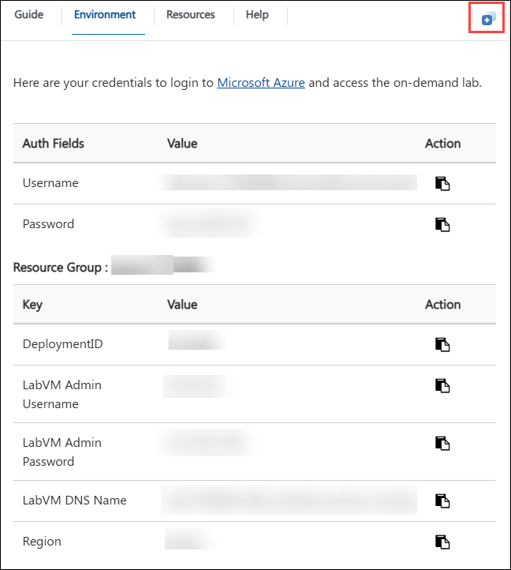
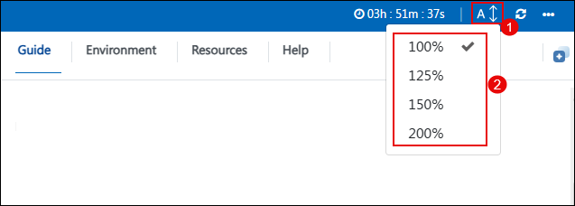

# Use your own data and explore content filter with Azure OpenAI services

### Overall Estimated Duration: 4 Hours

## Overview

This hands-on lab will allow you to explore how the Azure OpenAI Service integrates your own data with the intelligence of the underlying large language model (LLM). You'll learn how to control the model's use of your data, either by limiting it to specific topics or by blending it with results from the pre-trained model. The Azure OpenAI Service includes default content filters designed to identify and remove potentially harmful prompts and completions, ensuring safer interactions. Additionally, you'll have the opportunity to apply for custom content filters tailored to your specific needs, reinforcing responsible AI principles in your generative AI applications. Content filtering plays a vital role in a responsible AI strategy, and this lab will provide insight into its impact and effectiveness.

## Objective

By the end of this lab, you will be able to:

- **Use your own data with Azure OpenAI**: This hands-on exercise aims to provision an Azure OpenAI resource and deploy a model, observing its normal chat behavior initially. You will then connect your data, interact with the model using this data, set up and configure an application in Cloud Shell, and run it to test its functionality.
- **Explore content filters in Azure OpenAI**: This hands-on exercise aims to deploy an OpenAI model to generate natural language output and explore content filters to ensure the generated content meets desired standards. The content filtering system recognizes and responds to particular types of potentially dangerous content in input prompts and output completions.
  
## Pre-requisites

- Familiarity with Azure OpenAI Service.
- Basic understanding of large language models and their applications.

## Architecture

The architecture flow involves using the Azure OpenAI Service to integrate your data with a large language model (LLM), allowing you to manage how the model interacts with your information by focusing on specific topics or blending it with pre-trained results. The service employs default content filters to detect and remove harmful content, and you can also apply custom filters tailored to your needs. This approach ensures that content filtering is effectively used to uphold responsible AI practices, providing insights into its role in maintaining secure and safe interactions.

## Architecture Diagram

  

## Explanation of Components

1. **Azure OpenAI**: Azure OpenAI Service provides REST API access to OpenAI's powerful language models and these models integrates with your data, enabling customized and secure interactions.
1. **Azure OpenAI Models**: Offers pre-trained and customizable large language models for various AI applications. These models allow for powerful AI-driven solutions by generating tailored and contextually relevant content based on well-crafted prompts.
1. **Azure CloudShell**: Azure CloudShell offers an integrated, browser-based shell experience for managing Azure resources. It provides a ready-to-use environment with pre-installed tools and access to both Bash and PowerShell.
1. **Storage Account**: Manages and stores data, providing scalable and secure cloud storage solutions.
1. **Content Filter**: Detects and removes harmful content to ensure safe and responsible AI interactions.

## Getting Started with the Lab
 
## Accessing Your Lab Environment
 
Once you're ready to dive in, your virtual machine and **Lab guide** will be right at your fingertips within your web browser.

   

## Virtual Machine & Lab Guide
 
Your virtual machine is your workhorse throughout the workshop. The lab guide is your roadmap to success.
 
## Exploring Your Lab Resources
 
To get a better understanding of your lab resources and credentials, navigate to the **Environment** tab.
 
   
 
## Utilizing the Split Window Feature
 
For convenience, you can open the lab guide in a separate window by selecting the **Split Window** button from the Top right corner.
 
 
 
## Managing Your Virtual Machine
 
Feel free to **Start, Stop, or Restart (2)** your virtual machine as needed from the **Resources (1)** tab. Your experience is in your hands!
 

## Lab Validation

After completing the task, hit the **Validate** button under the Validation tab integrated within your lab guide. If you receive a success message, you can proceed to the next task; if not, carefully read the error message and retry the step, following the instructions in the lab guide.

## Lab Guide Zoom In/Zoom Out

To adjust the zoom level in the lab environment, click the **A↕ (1)** icon next to the timer and select a preferred zoom option from the **dropdown menu (2)**.

   

## Let's Get Started with Azure Portal

1. On your virtual machine, click on the Azure Portal icon as shown below:

   .png)
   
1. You'll see the **Sign into Microsoft Azure** tab. Here, enter your credentials:
 
   - **Email/Username:** <inject key="AzureAdUserEmail"></inject>
 
       
 
1. Next, provide your password:
 
   - **Password:** <inject key="AzureAdUserPassword"></inject>
 
       
    
1. If prompted to **Stay signed in**, you can click **No**.
 
1. If a **Welcome to Microsoft Azure** pop-up window appears, simply click **Cancel** to skip the tour.

## Support Contact

The CloudLabs support team is available 24/7, 365 days a year, via email and live chat to ensure seamless assistance at any time. We offer dedicated support channels tailored specifically for both learners and instructors, ensuring that all your needs are promptly and efficiently addressed.

Learner Support Contacts:

- Email Support: cloudlabs-support@spektrasystems.com
- Live Chat Support: https://cloudlabs.ai/labs-support

Click **Next** from the bottom right corner to embark on your Lab journey!

   

## Happy Learning!!
