# Lab 01: Get started with Azure OpenAI Service

### Estimated Duration: 120 Minutes

## Lab overview

In this lab, you'll learn how to get started with Azure OpenAI by provisioning the service as an Azure resource and using the Azure AI Foundry portal to deploy and explore OpenAI models. Azure OpenAI Service brings the generative AI models developed by OpenAI to the Azure platform, enabling you to develop powerful AI solutions that benefit from the security, scalability, and integration of services provided by the Azure cloud platform. 

## Lab Objectives
In this lab, you will complete the following tasks:

- Task 1: Provision an Azure OpenAI resource
- Task 2: Deploy a model
- Task 3: Explore a model in the Completions playground
- Task 4: Use the Chat playground
- Task 5: Explore prompts and parameters 
- Task 6: Explore code generation

## Task 1: Provision an Azure OpenAI resource

In this task, you'll create an Azure resource in the Azure portal, selecting the OpenAI service and configuring settings such as region and pricing tier. This setup allows you to integrate OpenAI's advanced language models into your applications.

1. In the **Azure portal**, search for **OpenAI (1)** and select **Azure OpenAI (2)**.

   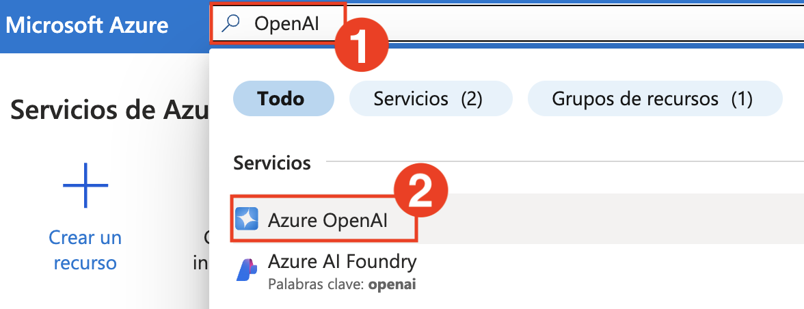

2. On **AI Foundry | Azure OpenAI** blade, click on **+ Create**.

   .png)

3. Fill in the required details on the **Create Azure OpenAI** page:
   
    - Subscription: Default - Pre-assigned subscription **(1)**
    - Resource group: **openai-<inject key="DeploymentID" enableCopy="false"></inject> (2)**
    - Region: Select **Sweden Central (3)**
    - Name: **OpenAI-Lab01-<inject key="DeploymentID" enableCopy="false"></inject> (4)**
    - Pricing tier: **Standard S0 (5)**
  
      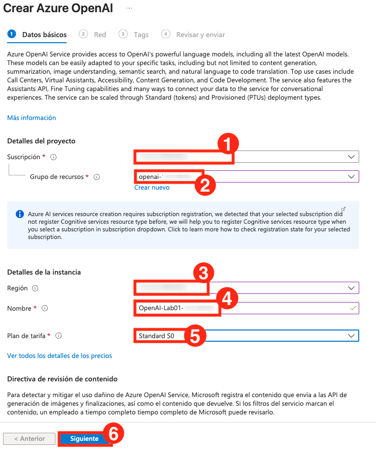

      >**Note:** Ensure the resource is deployed in the **Sweden Central** region.

4. Click **Next** on each tab without changing anything.

5. Finally, click **Review + create**, then click **Create** to start the deployment.

     .png "Create Azure OpenAI resource")

5. Wait for the deployment to complete, then go to the deployed resource from the notification pane.

> **Congratulations** on completing the task! Now, it's time to validate it. Here are the steps:
> - Hit the Validate button for the corresponding task. If you receive a success message, you can proceed to the next task. 
> - If not, carefully read the error message and retry the step, following the instructions in the lab guide. 
> - If you need any assistance, please contact us at cloudlabs-support@spektrasystems.com. We are available 24/7 to help you out.

<validation step="1fa0e87b-eb46-463d-b63b-edf6e2282e16" />

## Task 2: Deploy a model

In this task, you'll deploy a specific AI model instance within your Azure OpenAI resource to integrate advanced language capabilities into your applications.

1. From the **Azure portal**, navigate to your OpenAI resource **OpenAI-Lab01-<inject key="DeploymentID" enableCopy="false"></inject>**.

   .png)

1. On the **Azure OpenAI** resource page, click **Overview (1)**, then select **Go to Azure AI Foundry portal (2)** to navigate to the **Azure AI Foundry portal**.

   

1. On the **Azure AI Foundry portal** page, select **Deployments (1)** under **Shared resources** from the left pane. Then, click **+ Deploy Model (2)** and choose **Deploy base model (3)**.

   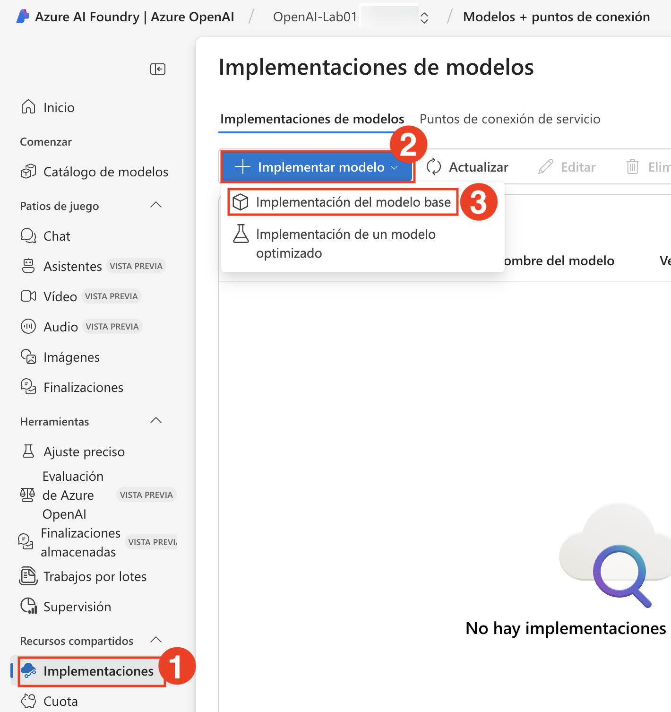

1. On the **Select a model** page, search for **gpt-4o-mini (1)**, then select **gpt-4o-mini (2)**, and then click on **Confirm (3)**

   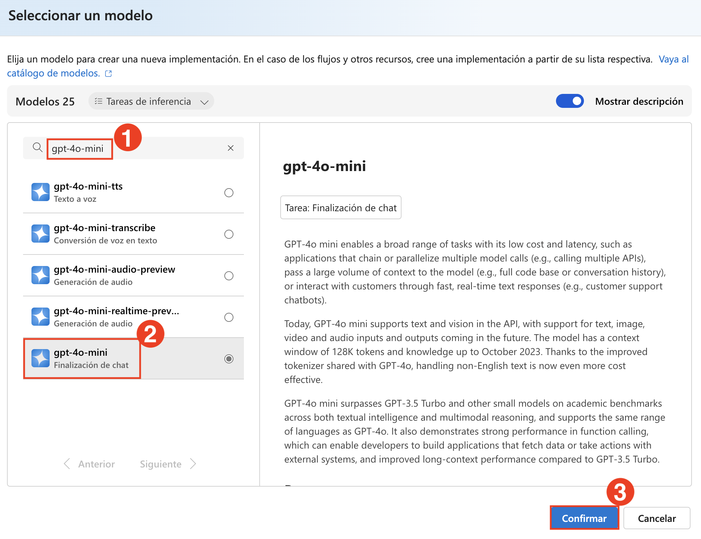

1. Click on **Customize**.
   
   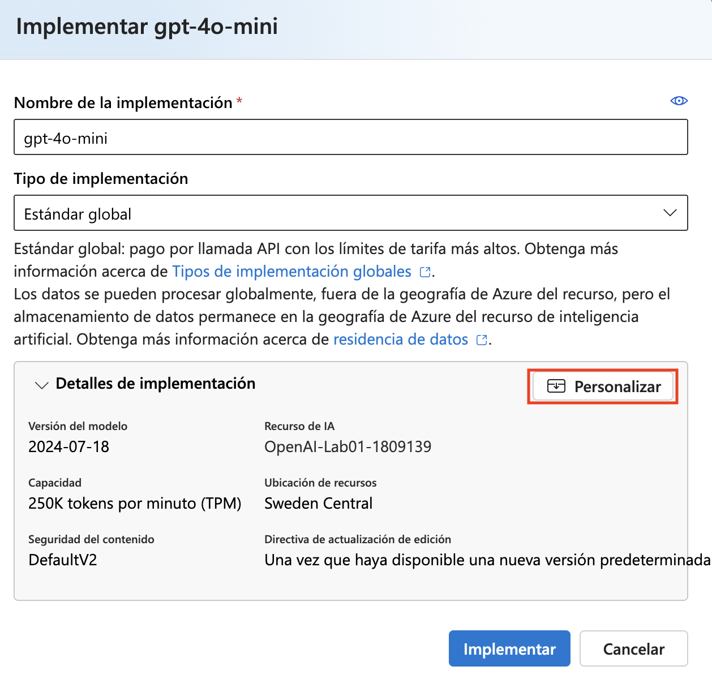   

1. Within the **Deploy model** pop-up interface, enter the following details:

      - Deployment name: **my-gpt-model (1)**
      - Deployment type: **Standard (2)**
      - Model version: **2024-07-18 (Default) (3)**
      - Tokens per Minute Rate Limit (thousands): **8K (4)**
      - Content filter: **DefaultV2 (5)**
      - Enable dynamic quota: **Enabled (6)**
      - Click on **Deploy** **(7)**
  
           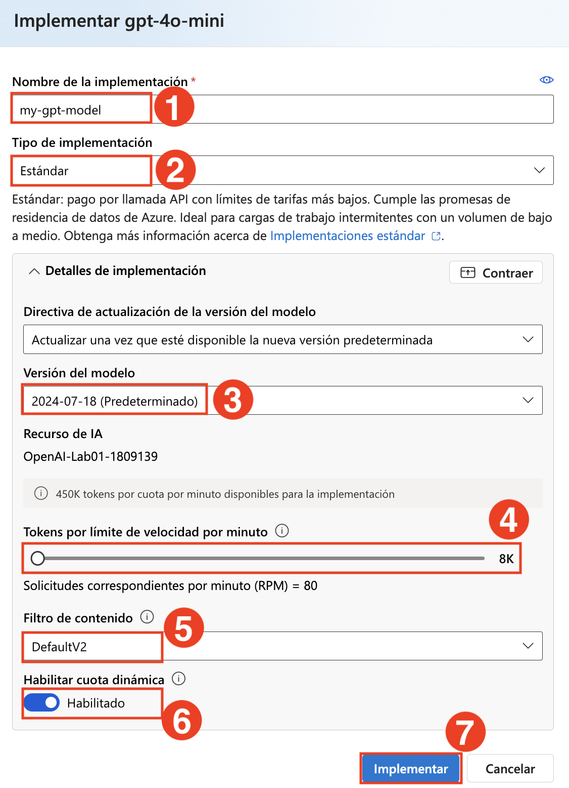

           >**Note**: gpt-4o-mini is supported only for chat completions, and it is not supported for completions API.

1. Click the **back arrow** to return to the previous screen, then in the left pane under **Shared Resources**, select **Deployments (1)**. Next, click **+ Deploy Model (2)** and choose **Deploy base model (3)**.

      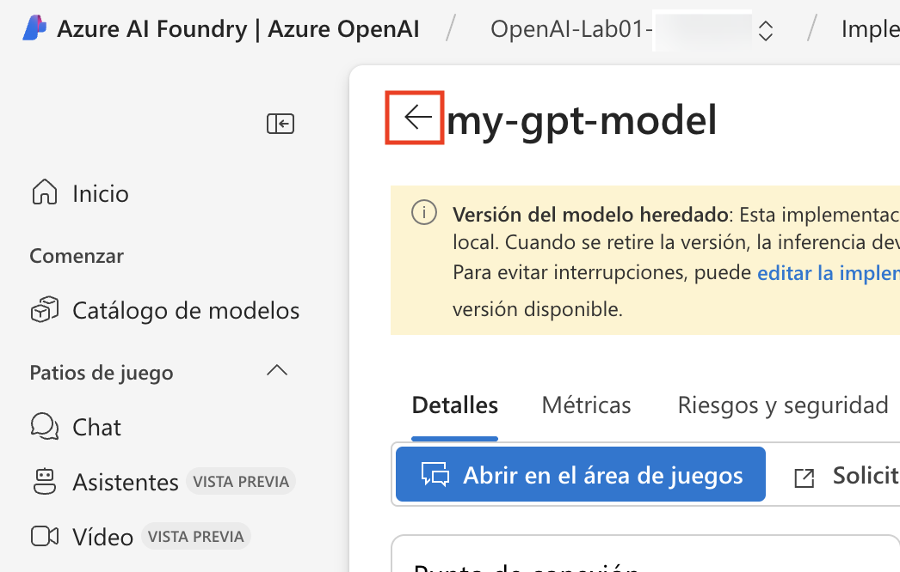

      

1. On the **Select a model** page, search for **gpt-35-turbo-instruct (1)**, then select **gpt-35-turbo-instruct (2)**, and then click on **Confirm (3)**.

   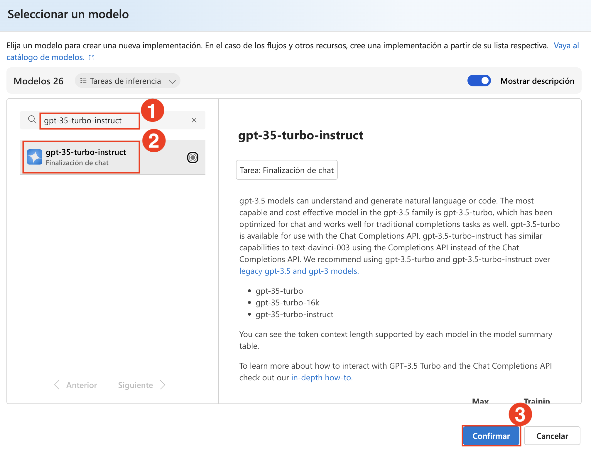

1. Click on **Customize**.

   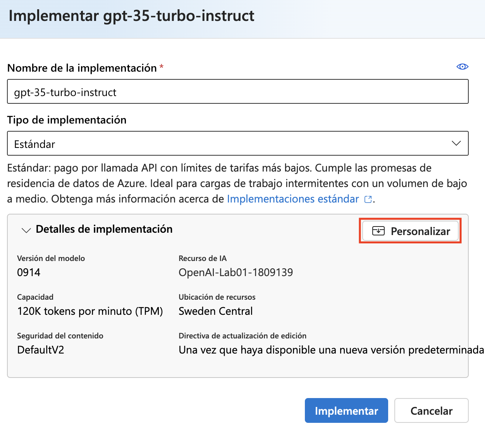
   
1. Within the **Deploy model** pop-up interface, enter the following details:
      - Deployment name: **gpt-35-turbo-instruct (1)**
      - Deployment type: **Standard (2)**
      - Model version: **0914 (Default) (3)**
      - Tokens per Minute Rate Limit (thousands): **20K (4)**
      - Content filter: **DefaultV2 (5)**      
      - Enable dynamic quota: **Enabled (6)**
      - Click on **Deploy** **(7)**
  
        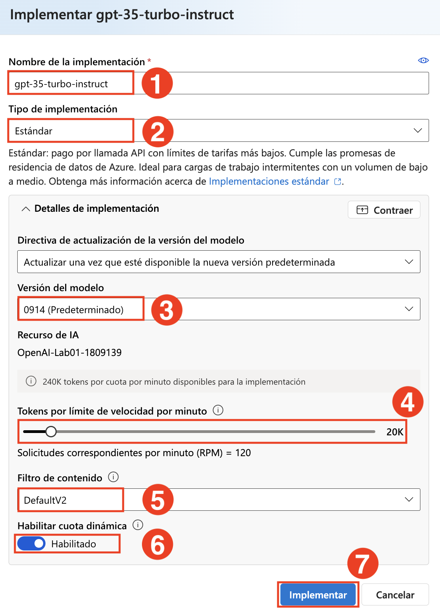

1. These will deploy models that you can experiment with for both chat and completion tasks as you go along.

      > **Note**: You can ignore any error related to the assignment of roles to view the quota limits. 
   
   > **Congratulations** on completing the task! Now, it's time to validate it. Here are the steps
   > - Hit the Validate button for the corresponding task. If you receive a success message, you can proceed to the next task. 
   > - If not, carefully read the error message and retry the step, following the instructions in the lab guide.
   > - If you need any assistance, please contact us at cloudlabs-support@spektrasystems.com. We are available 24/7 to help you out.

   <validation step="3b4a472e-f956-45d8-b828-3e2cc01c2e88" />

## Task 3: Explore a model in the Completions playground

In this task, you'll explore a model in the Completions playground that involves interacting with the AI model to test and refine its responses using real-time input and output examples.

1. In the Azure OpenAI Foundry portal, navigate to the left pane and select **Playgrounds (1) -> Completions (2)**.

   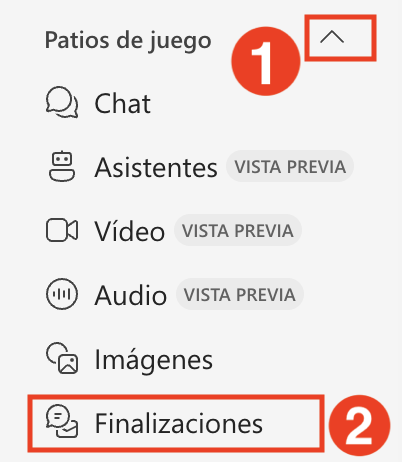

2. On the **Completions** page:

   * Ensure that **gpt-35-turbo-instruct (1)** is selected under **Deployments**.
   * In the **Prompt (2)** text box, enter the following prompt:

     ```
     Generate a quiz of 5 questions. For each question, provide me with the answer options and the correct answer.
     ```

   * Click **Generate (3)** to submit the prompt and receive the response.

     .png)

      >**Note:** The summarised text sample consists of a *prompt* that provides some text to tell the model what kind of response is required and includes some contextual information.

3. The response consists of a quiz based on the example in the prompt.

    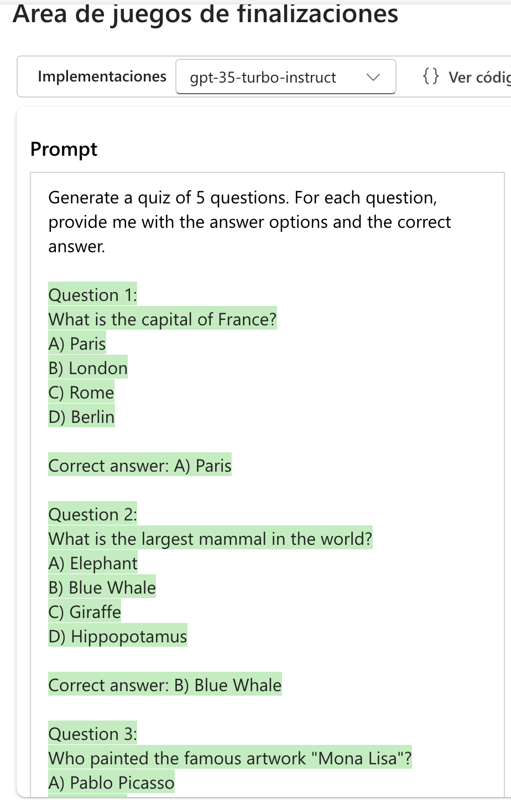

   >**Note:** The output of the chat may vary. The screenshot is provided for reference only and may not reflect the exact same output.

   >**Note**: You can use the **Regenerate** button to resubmit the prompt(new changes have been made), and note that the response may vary from the original one. A generative AI model can produce new language each time it's called.

4. At the bottom of the page, note the number of *tokens* detected in the text. Tokens are the basic units of a prompt - essentially, words or word parts in the text.

5. Use the **View Code** button to view the code that a client application would use to submit the prompt. You can select your preferred programming language. The prompt contains the text you submitted to the model. The request is submitted to the *Completions* API for your Azure OpenAI service.

      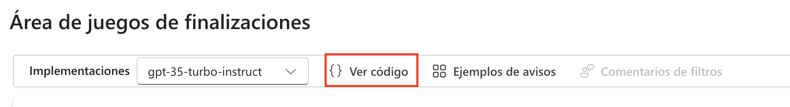

      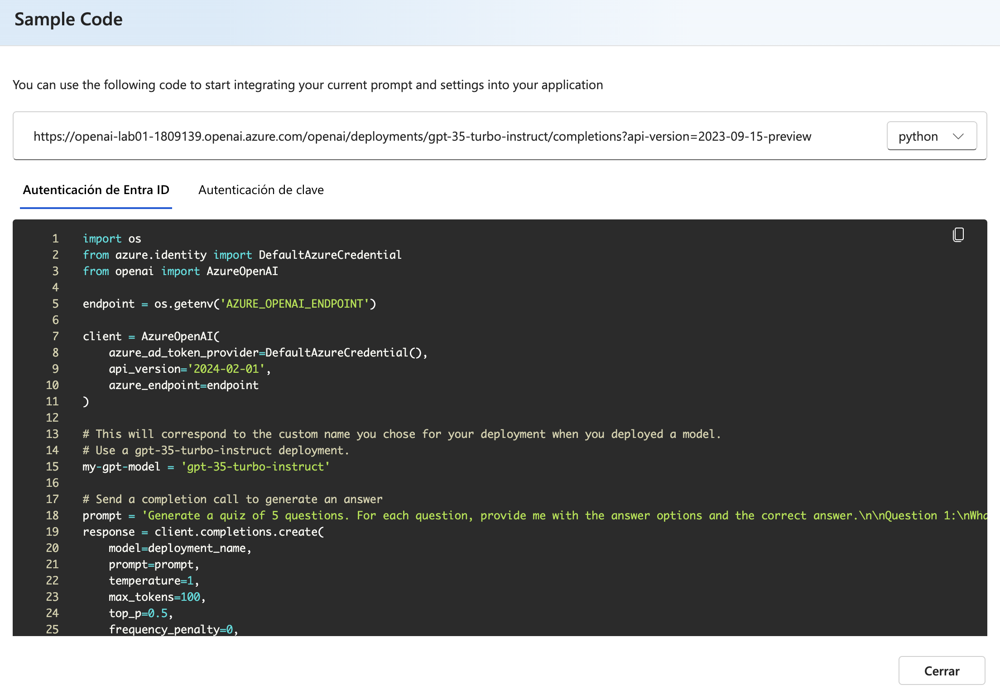
    
6. Close the **Sample Code** window once you’ve reviewed the content.

## Task 4: Use the Chat playground

In this task, you'll use the Chat playground to interact with and test the AI model's conversational abilities through a simulated chat interface.

1. Navigate to the **Shared resources** section in the left-hand menu and select **Deployments (1)**. From the list of available deployments, choose **my-gpt-model**, then click on **Open in playground (2)**. This action will launch the **Chat Playground**, where you can interact with the deployed model in a conversational interface.

   .png)

   .png)

2. In the **Setup** pane:

   * Replace the default **System message (1)** with the following instruction:

     ```
     The system is an AI teacher that helps people learn about AI.
     ```
   * Click **Apply changes (2)** and confirm by selecting **Continue** on the prompt.

      

      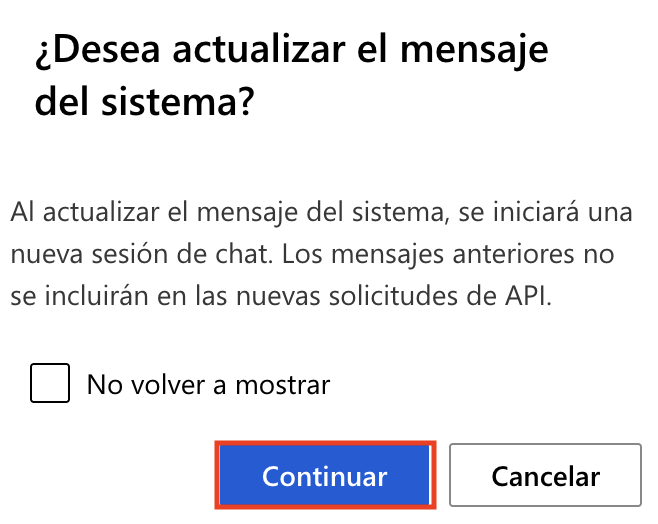
   
1. In the **Setup (1)** section, click on **+ Add section (2)** box, then click on **Examples (3)**.

      .png)

1. Enter the following message and response in the designated boxes:

      - **User (1)**:
        ```
        What are the different types of artificial intelligence?
        ```
    
      - **Assistant (2)**:
        ```
        There are three main types of artificial intelligence: Narrow or Weak AI (such as virtual assistants like Siri or Alexa, image recognition software, and spam filters), General or Strong AI (AI designed to be as intelligent as a human being. This type of AI does not currently exist and is purely theoretical), and Artificial Superintelligence (AI that is more intelligent than any human being and can perform tasks that are beyond human comprehension. This type of AI is also purely theoretical and has not yet been developed).
        ``` 

         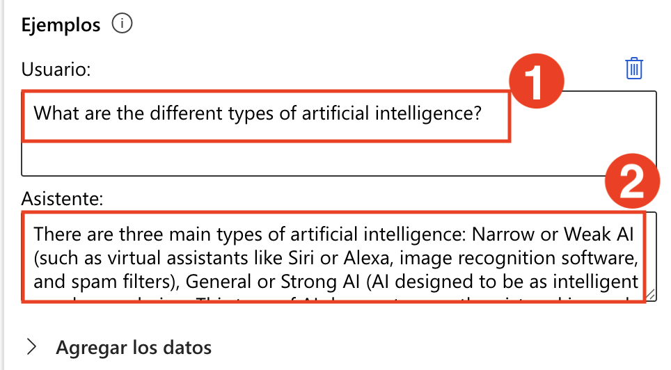
   
         > **Note**: Few-shot examples are used to provide the model with examples of the types of responses that are expected. The model will attempt to reflect the tone and style of the examples in its own responses.

1. Click **Apply changes**, then **Continue** to initialize the chat with the updated context.

      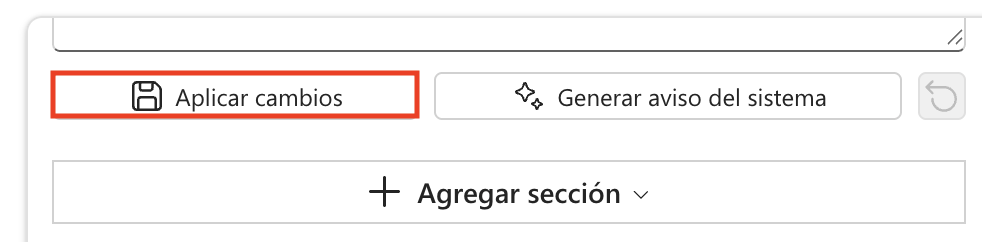

      
   
1. In the query box at the bottom of the page, enter the below-mentioned text **(1)**. Use the **Send (2)** button to submit the message and view the response.

   ```
   What is artificial intelligence?
   ```

   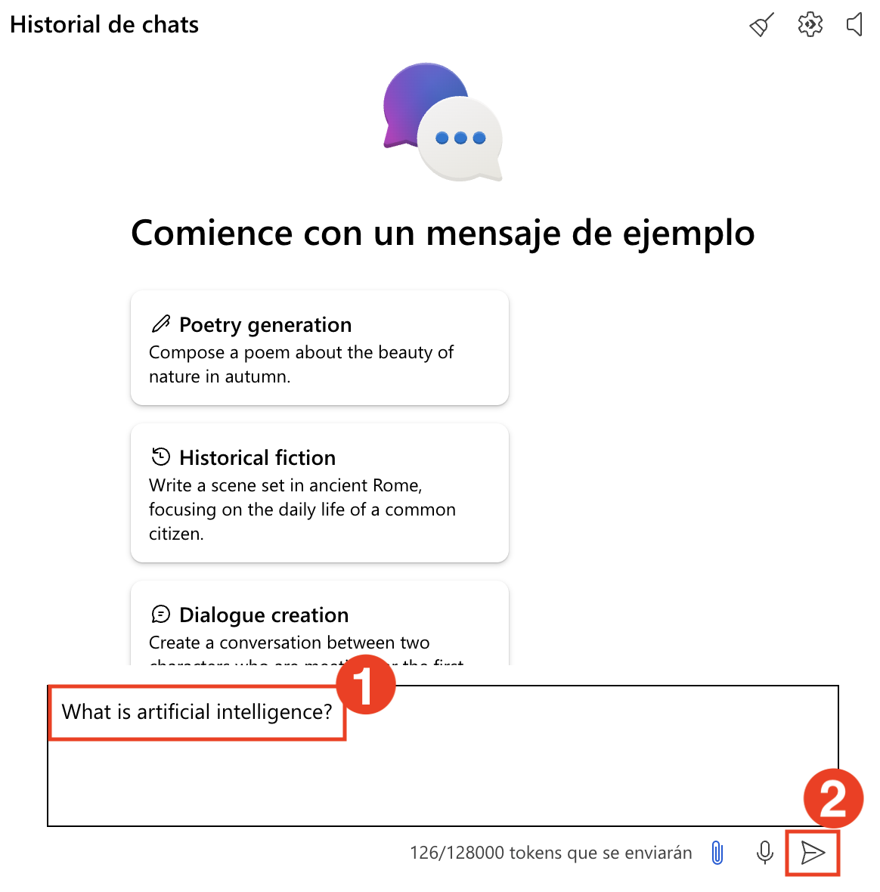
   
      > **Note**: You may receive a response that the API deployment is not yet ready. If so, wait for a few minutes and try again.

1. Review the response.

   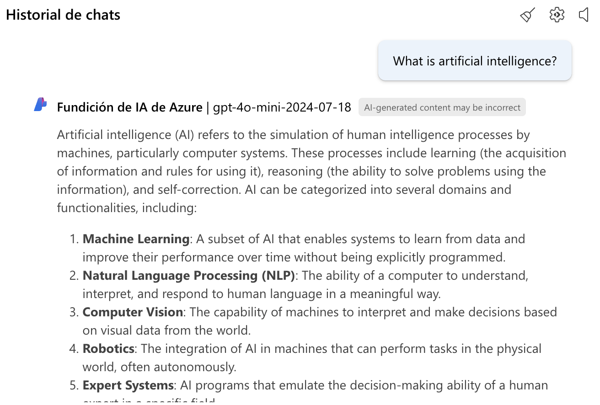

1. After reviewing the response, submit the following follow-up message:

   ```
   `How is it related to machine learning?`
   ```

1. Review the response, noting that context from the previous interaction is retained (so the model understands that "it" refers to artificial intelligence).

     .png)

1. Use the **View Code** button to view the code for the interaction. The prompt consists of the *system* message, the few-shot examples of *user* and *assistant* messages, and the sequence of *user* and *assistant* messages in the chat session so far.

      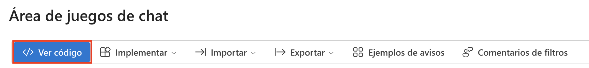

      .png)

## Task 5: Explore prompts and parameters

In this task, you'll explore prompts and parameters by experimenting with different inputs and settings to fine-tune the AI model's responses and behavior.

1. In the **Chat Configuration** pane, go to **Parameters (1)** and set the following values:

   * **Max response tokens (2)**: 500
   * **Temperature (3)**: 0 (for deterministic responses)

     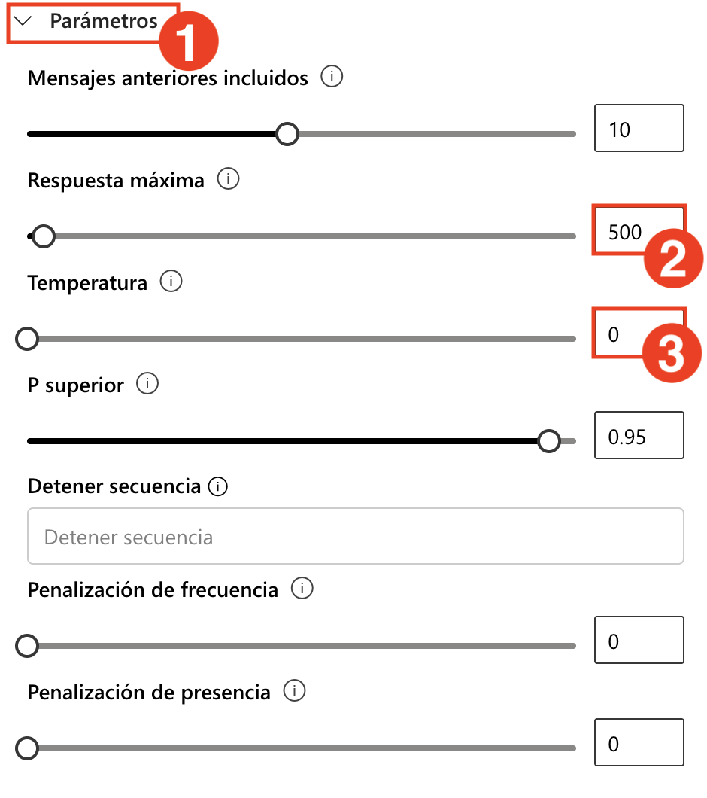
      
2. In the chat input box, enter the message **(1)** and click **Submit (2)** to send it.

      ```
      Write three multiple-choice questions based on the following text.

      Most computer vision solutions are based on machine learning models that can be applied to visual input from cameras, videos, or images.*

      - Image classification involves training a machine learning model to classify images based on their contents. For example, in a traffic monitoring solution, you might use an image classification model to classify images based on the type of vehicle they contain, such as taxis, buses, cyclists, and so on.*

      - Object detection machine learning models are trained to classify individual objects within an image and identify their location with a bounding box. For example, a traffic monitoring solution might use object detection to identify the location of different classes of vehicles.*

      - Semantic segmentation is an advanced machine learning technique in which individual pixels in the image are classified according to the object to which they belong. For example, a traffic monitoring solution might overlay traffic images with "mask" layers to highlight different vehicles using specific colors.
      ```

      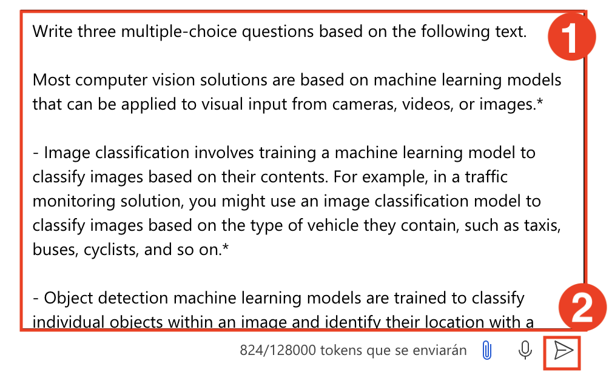

3. Review the results, which should consist of multiple-choice questions that a teacher could use to test students on the computer vision topics in the prompt. The total response should be smaller than the maximum length you specified as a parameter.

      
   
4. Observe the following about the prompt and parameters you used:

      - The prompt specifically states that the desired output should be three multiple-choice questions.
       
      - The parameters include *Temperature*, which controls the degree to which response generation includes an element of randomness. The value of **0** used in your submission minimizes randomness, resulting in stable, predictable responses.

## Task 6: Explore code generation

In this task, you'll explore code generation by testing the AI model’s ability to generate and suggest code snippets based on various programming prompts and requirements.

1. In the **Setup** pane, update the **System message (1)** to:

   ```
   You are a Python developer.
   ```

   * Click **Apply changes (2)** and then **Continue** when prompted.

     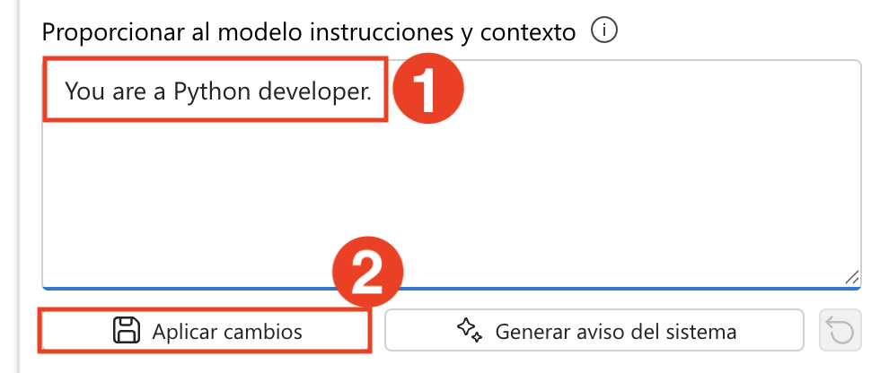

     

2. In the **Chat session** pane, select the **Clear chat** button, then select **Clear** from the pop-up window to clear the chat history and start a new session.

      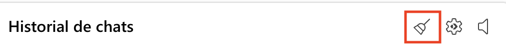

      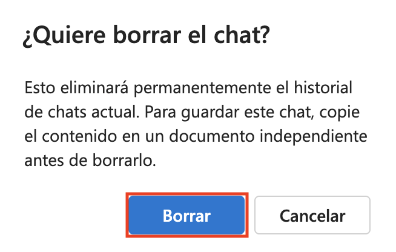

4. Enter the following prompt:

      ```
      Write a Python function named Multiply that multiplies two numeric parameters.
      ```

5. Review the generated Python code snippet. The model should return a valid function definition that multiplies two inputs and returns the result.

     

## Summary

In this lab,
- You provisioned an **Azure OpenAI resource** to integrate generative AI capabilities into your applications.
- You **deployed two models** (gpt-4o-mini for chat and gpt-35-turbo-instruct for completions) using the Azure AI Foundry portal.
- You explored the models in the **Completions and Chat playgrounds**, experimented with prompts and parameters, and tested the model’s **code generation abilities**.


### You have successfully completed the lab. Click on Next >> to proceed with the next lab.
     
   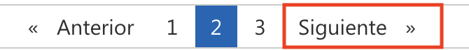
