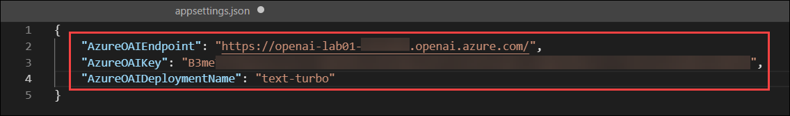
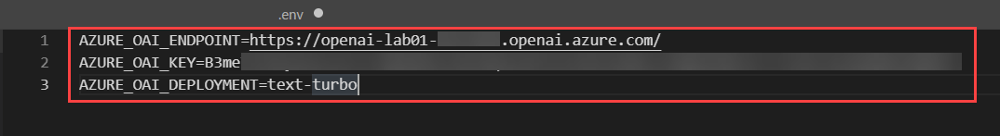
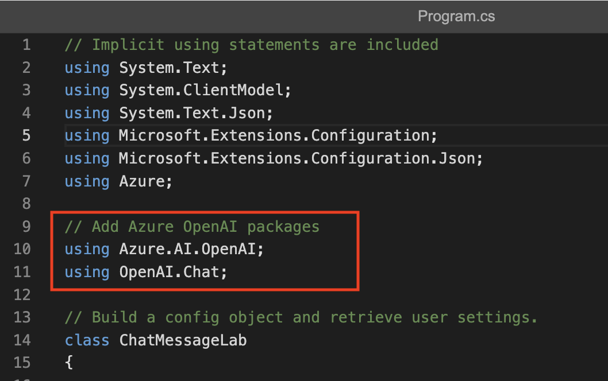
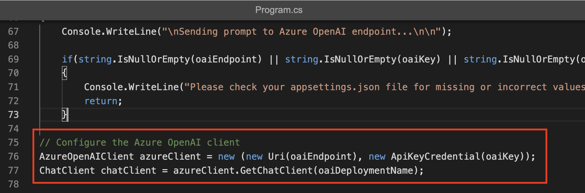
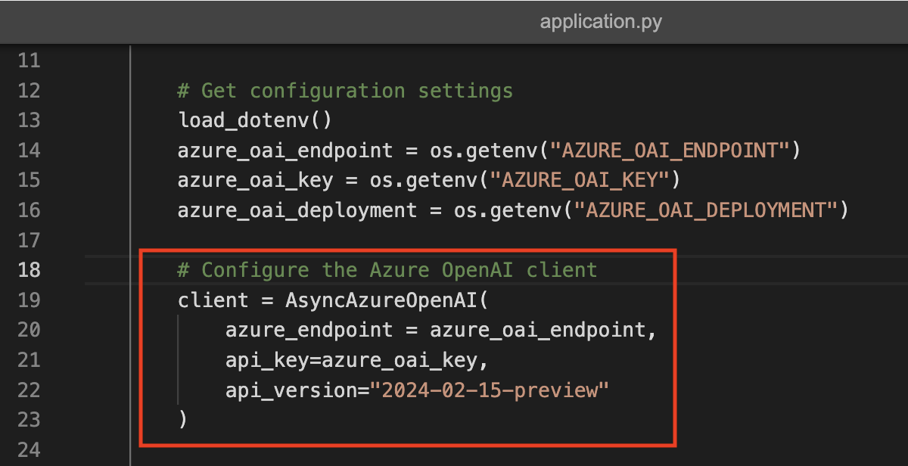
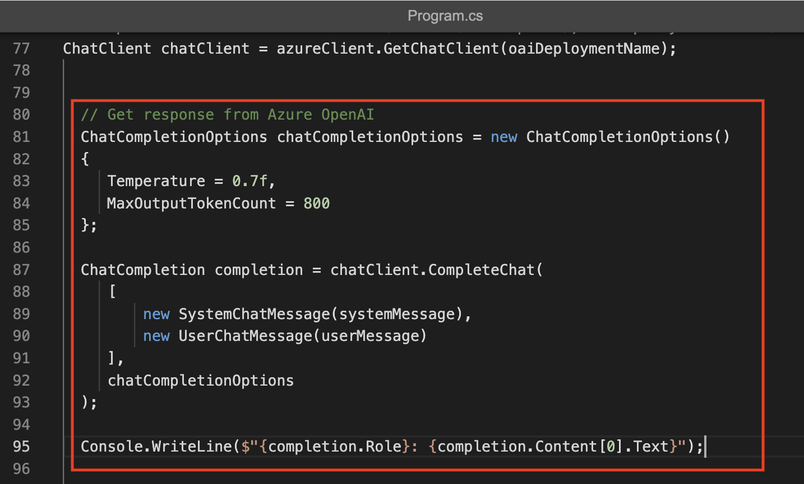
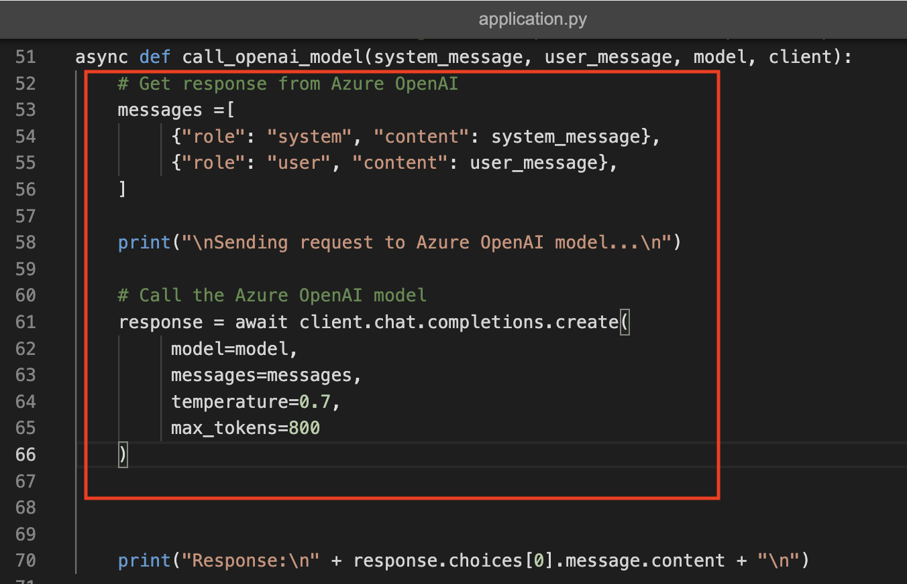

# Laboratorio 02: Utilizar los SDKs de Azure OpenAI en su aplicación

### Duración Estimada: 120 minutos

En el laboratorio, desempeñará el papel de un desarrollador de software al que se le ha encargado implementar una aplicación que pueda usar IA generativa para ayudar a proporcionar recomendaciones de senderismo. Las técnicas utilizadas en el ejercicio pueden aplicarse a cualquier aplicación que utilice APIs de Azure OpenAI.

Con el Servicio Azure OpenAI, los desarrolladores pueden crear chatbots, modelos de lenguaje y otras aplicaciones que se destacan en la comprensión del lenguaje humano natural. Azure OpenAI proporciona acceso a modelos de IA pre-entrenados, así como a un conjunto de APIs y herramientas para personalizar y ajustar estos modelos para cumplir con los requisitos específicos de su aplicación. En este ejercicio, aprenderá a implementar un modelo en Azure OpenAI y a usarlo en su propia aplicación.

## Objetivos del laboratorio
En este laboratorio, completará las siguientes tareas:

- Tarea 1: Aprovisionar un recurso Azure OpenAI
- Tarea 2: Configurar una aplicación en Cloud Shell
- Tarea 3: Configurar su aplicación
- Tarea 4: Probar su aplicación

### Tarea 1: Aprovisionar un recurso de Azure OpenAI

Antes de poder usar modelos de Azure OpenAI, debe aprovisionar un recurso de Azure OpenAI en su suscripción de Azure.

1. En el **Portal de Azure**, busque **OpenAI (1)** y seleccione **Azure OpenAI (2)** en la sección de Servicios.

   .png)

2. En la página **AI Foundry  | Azure OpenAI**, seleccione **OpenAI-Lab01-<inject key="DeploymentID" enableCopy="false"></inject>**

   (upd).png)

3. Para capturar los valores de las Claves y Punto de conexión, en la hoja **OpenAI-Lab01-<inject key="DeploymentID" enableCopy="false"></inject>**:
      - Seleccione **Claves y punto de conexión (1)** debajo de **Administración de recursos**.
      - Haga clic en **Mostrar claves (2)**.
      - Copie la **Clave 1 (3)** y asegúrese de pegarla en un editor de texto como el Bloc de notas para referencia futura.
      - Finalmente, copie la URL del **Extremo (4)** de la API haciendo clic en copiar al portapapeles. 

        (upd).png "Claves y punto de conexión")

### Tarea 2: Configurar una aplicación en Cloud Shell

Para mostrar cómo integrar con un modelo de Azure OpenAI, usaremos una aplicación de línea de comandos breve que se ejecuta en Cloud Shell en Azure. Abra una nueva pestaña del navegador para trabajar con Cloud Shell.

1. En el [portal de Azure](https://portal.azure.com?azure-portal=true), seleccione el botón **[>_]** (*Cloud Shell*) en la parte superior de la página a la derecha del cuadro de búsqueda. Se abrirá un panel de Cloud Shell en la parte inferior del portal.

   

   
   >**Nota:** Si no puede encontrar Cloud Shell, haga clic en los **puntos suspensivos (...) (1)** y luego seleccione **Cloud Shell (2)** del menú.

    (upd).png)

2. La primera vez que abra Cloud Shell, es posible que se le solicite que elija el tipo de shell que desea usar (*Bash* o *PowerShell*). Seleccione **Bash**. Si no ve esta opción, omita el paso.

    (upd).png)

3. En el panel Comenzar, seleccione **Montar cuenta de almacenamiento (1)**, seleccione su **Suscripción de la cuenta de almacenamiento (2)** en el menú desplegable y haga clic en **Aplicar (3)**.

   

4. En el panel **Montar cuenta de almacenamiento**, seleccione **Quiero crear una cuenta de almacenamiento (1)** y haga clic en **Siguiente (2)**.

   

5. En la página **Crear cuenta de almacenamiento**, ingrese los siguientes detalles:

    - Suscripción: Elija la suscripción predeterminada **(1)**.
    - Grupo de recursos: Seleccione **openai-<inject key="DeploymentID" enableCopy="false"></inject> (2)**
    - Región: **<inject key="Region" enableCopy="false" /> (3)**
    - Nombre de la cuenta de almacenamiento: **storage<inject key="DeploymentID" enableCopy="false"></inject> (4)**
    - Recurso compartido de archivos: Cree un nuevo recurso compartido de archivos llamado **none** **(5)**
    - Haga clic en **Crear** **(6)**

      .png "Crear almacenamiento - configuración avanzada")

6. Tenga en cuenta que puede cambiar el tamaño del Cloud Shell arrastrando la barra separadora en la parte superior de la página o usando los íconos **&#8212;**, **&#9723;** y **X** en la parte superior derecha de la página para minimizar, maximizar y cerrar el panel. Para obtener más información sobre el uso de Azure Cloud Shell, consulte la [documentación de Azure Cloud Shell](https://docs.microsoft.com/azure/cloud-shell/overview).

7. Una vez que se abra la terminal, haga clic en **Configuración (1)** y seleccione **Ir a la versión clásica (2)**.

   .png)

8. Una vez que se inicie la terminal, ingrese el siguiente comando para descargar la aplicación de muestra y guárdela en una carpeta llamada `mslearn-openai`.

    ```bash
   rm -r mslearn-openai -f
   git clone https://github.com/MicrosoftLearning/mslearn-openai mslearn-openai
    ```

        
  
9. Los archivos se descargan en una carpeta llamada **mslearn-openai**. Navegue hasta los archivos de laboratorio para este ejercicio con el siguiente comando.

    ```bash
   cd mslearn-openai/Labfiles/01-app-develop
    ```

    Se han proporcionado aplicaciones para C# y Python, así como un archivo de texto de ejemplo que utilizará para probar el resumen. Ambas aplicaciones cuentan con la misma funcionalidad.

10. Abra el editor de código integrado y observe el archivo de texto que resumirá con su modelo. Use el siguiente comando para abrir los archivos de laboratorio en el editor de código.

    ```bash
    code .
    ```
   
> ¡**Felicitaciones** por completar la tarea! Ahora es momento de validarla. Estos son los pasos:
> - Presione el botón Validar para la tarea correspondiente. Si recibe un mensaje de éxito, puede continuar con la siguiente tarea. 
> - De lo contrario, lea atentamente el mensaje de error y vuelva a intentar el paso, siguiendo las instrucciones de la guía de laboratorio.
> - Si necesita ayuda, comuníquese con nosotros a cloudlabs-support@spektrasystems.com. Estamos disponibles las 24 horas del día, los 7 días de la semana para ayudarlo.

   <validation step="bd2f25c6-d67e-4553-a8ed-32e9f0162e26" />


### Tarea 3: Configurar su aplicación

En esta tarea, completará algunas partes clave de la aplicación para habilitar el uso de su recurso de Azure OpenAI.

1. En el editor de código, expanda la carpeta **CSharp** o **Python**, según su lenguaje de preferencia.

1. Si está utilizando el lenguaje **C#**, abra el archivo **CSharp.csproj** y reemplácelo con el siguiente código y **guarde** el archivo.   

   ```
   <Project Sdk="Microsoft.NET.Sdk">
   
   <PropertyGroup>
   <OutputType>Exe</OutputType>
   <TargetFramework>net9.0</TargetFramework>
   <ImplicitUsings>enable</ImplicitUsings>
   <Nullable>enable</Nullable>
   </PropertyGroup>
   
    <ItemGroup>
    <PackageReference Include="Azure.AI.OpenAI" Version="2.1.0" />
    <PackageReference Include="Microsoft.Extensions.Configuration" Version="8.0.*" />
    <PackageReference Include="Microsoft.Extensions.Configuration.Json" Version="8.0.*" />
    </ItemGroup>
   
    <ItemGroup>
      <None Update="appsettings.json">
        <CopyToOutputDirectory>PreserveNewest</CopyToOutputDirectory>
       </None>
     </ItemGroup>
   
    </Project> 
   ```

1. Abra el archivo de configuración de su lenguaje:

    - C#: `appsettings.json`
    
    - Python: `.env`
    
1. Actualice los valores de configuración para incluir el **extremo** y la **clave** del recurso de Azure OpenAI que creó, así como el nombre del modelo que implementó, `my-gpt-model`. Luego, guarde el archivo haciendo clic derecho en el archivo desde el panel izquierdo y presione **Guardar**.

    - C#:
     
         

    - Python:
     
                 

       > **Nota:** Puede obtener los valores del extremo y la clave de Azure OpenAI desde la sección **Claves y punto de conexión** del recurso de Azure OpenAI bajo **Administración de recursos**.

1. Navegue de vuelta al Cloudshell e instale los paquetes necesarios para su lenguaje preferido:

  **C#:** 

    ```bash
    cd CSharp
    dotnet add package Azure.AI.OpenAI --version 2.1.0
    ```

    **Python:** 

    ```bash
    cd Python
    python -m venv labenv
   ./labenv/bin/Activate.ps1
    pip install python-dotenv openai==1.65.2 --user
    ```

1. Navegue hasta la carpeta de su lenguaje preferido, reemplace el comentario **Add Azure OpenAI package** con código para agregar la biblioteca Azure OpenAI SDK:

    **C#:** Program.cs

    ```csharp
    // Add Azure OpenAI packages
    using Azure.AI.OpenAI;
    using OpenAI.Chat;
    ```

      

    **Python:** application.py

    ```python
    # Add Azure OpenAI package
    from openai import AsyncAzureOpenAI
    ```

             

1.  En el código de la aplicación para su lenguaje, encuentre el comentario **Configure the Azure OpenAI client**, y agregue código para configurar el cliente de Azure OpenAI:

    **C#:** Program.cs

    ```csharp
    // Configure the Azure OpenAI client
    AzureOpenAIClient azureClient = new (new Uri(oaiEndpoint), new ApiKeyCredential(oaiKey));
    ChatClient chatClient = azureClient.GetChatClient(oaiDeploymentName);
    ```

       

    **Python:** application.py

    ```python
    # Configure the Azure OpenAI client
    client = AsyncAzureOpenAI(
       azure_endpoint = azure_oai_endpoint, 
       api_key=azure_oai_key,  
       api_version="2024-02-15-preview"
      )
    ```

        

      >**Nota:** Asegúrese de indentar el código eliminando los espacios en blanco adicionales después de pegarlo en el editor de código.
    
1. En la función que llama al **modelo Azure OpenAI**, bajo el comentario **Get response from Azure OpenAI**, agregue el código para formatear y enviar la solicitud al modelo.

     **C#:** Program.cs

    ```csharp
      // Get response from Azure OpenAI
      ChatCompletionOptions chatCompletionOptions = new ChatCompletionOptions()
      {
         Temperature = 0.7f,
         MaxOutputTokenCount = 800
      };
      
      ChatCompletion completion = chatClient.CompleteChat(
         [
             new SystemChatMessage(systemMessage),
             new UserChatMessage(userMessage)
         ],
         chatCompletionOptions
      );
      
      Console.WriteLine($"{completion.Role}: {completion.Content[0].Text}");
    ```

           

    **Python:** application.py

    ```python
    # Get response from Azure OpenAI
      messages =[
         {"role": "system", "content": system_message},
         {"role": "user", "content": user_message},
      ]
      
      print("\nSending request to Azure OpenAI model...\n")
      
      # Call the Azure OpenAI model
      response = await client.chat.completions.create(
         model=model,
         messages=messages,
         temperature=0.7,
         max_tokens=800
      )
    ```

           

1. Antes de poder guardar el archivo, asegúrese de que su código se parezca al código que se proporciona a continuación.

    **C#**: Program.cs
      
      ```CSharp
      // Implicit using statements are included
      using System.Text;
      using System.ClientModel;
      using System.Text.Json;
      using Microsoft.Extensions.Configuration;
      using Microsoft.Extensions.Configuration.Json;
      using Azure;
      
      // Add Azure OpenAI packages
          using Azure.AI.OpenAI;
          using OpenAI.Chat;
      
      // Build a config object and retrieve user settings.
      class ChatMessageLab
      {
      
      static string? oaiEndpoint;
      static string? oaiKey;
      static string? oaiDeploymentName;
          static void Main(string[] args)
      {
      IConfiguration config = new ConfigurationBuilder()
          .AddJsonFile("appsettings.json")
          .Build();
      
      oaiEndpoint = config["AzureOAIEndpoint"];
      oaiKey = config["AzureOAIKey"];
      oaiDeploymentName = config["AzureOAIDeploymentName"];
      
      //Initialize messages list
      
      do {
          // Pause for system message update
          Console.WriteLine("-----------\nPausing the app to allow you to change the system prompt.\nPress any key to continue...");
          Console.ReadKey();
          
          Console.WriteLine("\nUsing system message from system.txt");
          string systemMessage = System.IO.File.ReadAllText("system.txt"); 
          systemMessage = systemMessage.Trim();
      
          Console.WriteLine("\nEnter user message or type 'quit' to exit:");
          string userMessage = Console.ReadLine() ?? "";
          userMessage = userMessage.Trim();
          
          if (systemMessage.ToLower() == "quit" || userMessage.ToLower() == "quit")
          {
              break;
          }
          else if (string.IsNullOrEmpty(systemMessage) || string.IsNullOrEmpty(userMessage))
          {
              Console.WriteLine("Please enter a system and user message.");
              continue;
          }
          else
          {
              // Format and send the request to the model
      
              GetResponseFromOpenAI(systemMessage, userMessage);
          }
      } while (true);
      
      }
      
      // Define the function that gets the response from Azure OpenAI endpoint
      private static void GetResponseFromOpenAI(string systemMessage, string userMessage)  
      {   
          Console.WriteLine("\nSending prompt to Azure OpenAI endpoint...\n\n");
      
          if(string.IsNullOrEmpty(oaiEndpoint) || string.IsNullOrEmpty(oaiKey) || string.IsNullOrEmpty(oaiDeploymentName) )
          {
              Console.WriteLine("Please check your appsettings.json file for missing or incorrect values.");
              return;
          }
      
      // Configure the Azure OpenAI client
      AzureOpenAIClient azureClient = new (new Uri(oaiEndpoint), new ApiKeyCredential(oaiKey));
      ChatClient chatClient = azureClient.GetChatClient(oaiDeploymentName);
      
      
      // Get response from Azure OpenAI
      
      ChatCompletionOptions chatCompletionOptions = new ChatCompletionOptions()
      {
         Temperature = 0.7f,
         MaxOutputTokenCount = 800
      };
      
      ChatCompletion completion = chatClient.CompleteChat(
         [
             new SystemChatMessage(systemMessage),
             new UserChatMessage(userMessage)
         ],
         chatCompletionOptions
      );
      
      Console.WriteLine($"{completion.Role}: {completion.Content[0].Text}");
      
      
      
      }
      
      }
      ```
    
   **Python:** application.py

      ```Python
      import os
      import asyncio
      from dotenv import load_dotenv
      
      # Add Azure OpenAI package
      from openai import AsyncAzureOpenAI
      
      async def main(): 
          try: 
              # Get configuration settings 
              load_dotenv()
              azure_oai_endpoint = os.getenv("AZURE_OAI_ENDPOINT")
              azure_oai_key = os.getenv("AZURE_OAI_KEY")
              azure_oai_deployment = os.getenv("AZURE_OAI_DEPLOYMENT")
              
              # Configure the Azure OpenAI client
              client = AsyncAzureOpenAI(
                  azure_endpoint=azure_oai_endpoint, 
                  api_key=azure_oai_key,  
                  api_version="2024-02-15-preview"
              )
      
              while True:
                  # Pause the app to allow the user to enter the system prompt
                  print("------------------\nPausing the app to allow you to change the system prompt.\nPress enter to continue...")
                  input()
      
                  # Read in system message and prompt for user message
                  system_text = open(file="system.txt", encoding="utf8").read().strip()
                  user_text = input("Enter user message, or 'quit' to exit: ")
                  if user_text.lower() == 'quit' or system_text.lower() == 'quit':
                      print('Exiting program...')
                      break
      
                  # Format and send the request to the model
                  await call_openai_model(
                      system_message=system_text, 
                      user_message=user_text, 
                      model=azure_oai_deployment, 
                      client=client
                  )
      
          except Exception as ex:
              print(ex)
      
      # Define the function that will get the response from Azure OpenAI endpoint
      async def call_openai_model(system_message, user_message, model, client):
          # Get response from Azure OpenAI
          messages = [
              {"role": "system", "content": system_message},
              {"role": "user", "content": user_message},
          ]
          
          print("\nSending request to Azure OpenAI model...\n")
          
          # Call the Azure OpenAI model
          response = await client.chat.completions.create(
              model=model,
              messages=messages,
              temperature=0.7,
              max_tokens=800
          )
      
          print("Response:\n" + response.choices[0].message.content + "\n")
      
      if __name__ == '__main__': 
          asyncio.run(main())
      ```
    
1. Para guardar los cambios realizados en el archivo, haga clic derecho en el espacio en blanco del editor de texto del archivo y presione **Guardar**.

   >**Nota:** Asegúrese de indentar el código eliminando los espacios en blanco adicionales después de pegarlo en el editor de código.

### Tarea 4: Probar su aplicación

Ahora que su aplicación ha sido configurada, puede ejecutarla para enviar su solicitud a su modelo y observar la respuesta. Notará que la única diferencia entre las diferentes opciones es el contenido del prompt; todos los demás parámetros (como el recuento de tokens y la temperatura) permanecen iguales para cada solicitud.

1. En la carpeta de su lenguaje preferido, abre el archivo **system.txt**. Para cada interacción, introduzca el **Mensaje del sistema** en este archivo y guárdelo. Cada iteración se pausará primero para que pueda modificar el mensaje del sistema.

1. En el panel de terminal interactivo, asegúrese de que el contexto de la carpeta sea la carpeta de su lenguaje preferido. Luego, ingrese el siguiente comando para ejecutar la aplicación.

    - **C#:** `dotnet run`
    
    - **Python:** `python application.py`

        > **Sugerencia**: Puede utilizar el icono **Maximizar tamaño del panel** (**^**) en la barra de herramientas de la terminal para ver más texto de la consola.

1. En la terminal, le pedirá que ingrese una tecla para continuar.

    .png)

1. Para la primera iteración, ingrese los siguientes prompts:

   **Mensaje del sistema:**
   
   ```
   You are an AI assistant
   ```
   
   >>**Nota:** El mensaje del sistema debe darse en system.txt en C# o Python. Siga los mismos pasos para los prompts restantes.
   
1. En Ingresar mensaje del usuario, proporcione el siguiente mensaje.

   **Mensaje del usuario:**
   
   ```
   Write an intro for a new wildlife Rescue 
   ```

   >>**Nota:** El mensaje del usuario debe darse en la terminal en C# o Python. Siga los mismos pasos para los prompts restantes.

1. Observe la salida. El modelo de IA probablemente producirá una buena introducción genérica a un rescate de vida silvestre.

1. A continuación, ingrese los siguientes prompts, que especifican un formato para la respuesta:

   **Mensaje del sistema:**
   
   ```
   You are an AI assistant helping to write emails
   ```

   **Mensaje del usuario:**
   
   ```
   Write a promotional email for a new wildlife rescue, including the following:-Rescue name is Contoso - It specializes in elephants - Call for donations to be given at our website
   ```

1. Observe la salida. Esta vez, probablemente verá el formato de un correo electrónico con los animales específicos incluidos, así como la llamada a donaciones.

1. A continuación, ingrese los siguientes prompts que además especifican el contenido:

   **Mensaje del sistema:**
   
   ```
   You are an AI assistant helping to write emails
   ```

   **Mensaje del usuario:**

   ```
   Write a promotional email for a new wildlife rescue, including the following: - Rescue name is Contoso - It specializes in elephants, as well as zebras and giraffes - Call for donations to be given at our website - Include a list of the current animals we have at our rescue after the signature, in the form of a table. These animals include elephants, zebras, gorillas, lizards, and jackrabbits.
   ```
   
1. Observe la salida, y vea cómo el correo electrónico ha cambiado basándose en sus instrucciones claras.   

1. A continuación, ingrese los siguientes prompts donde agregamos detalles sobre el tono al mensaje del sistema:

   **Mensaje del sistema:**
   
   ```
   You are an AI assistant that helps write promotional emails to generate interest in a new business. Your tone is light, chit-chat oriented, and you always include at least two jokes.
   ```

   **Mensaje del usuario:**

   ```
   Write a promotional email for a new wildlife rescue, including the following: - Rescue name is Contoso - It specializes in elephants, as well as zebras and giraffes - Call for donations to be given at our website - Include a list of the current animals we have at our rescue after the signature, in the form of a table. These animals include elephants, zebras, gorillas, lizards, and jackrabbits..
   ```

1. Observe la salida. Esta vez, probablemente verá el correo electrónico en un formato similar, pero con un tono mucho más informal. ¡Probablemente incluso verá bromas incluidas!

## Resumen

En este laboratorio, logró lo siguiente:
- Aprovisionar un recurso de Azure OpenAI
- Implementar un modelo de OpenAI dentro del portal Azure AI Foundry
- Integrar modelos de Azure OpenAI en sus aplicaciones

### Ha completado con éxito el laboratorio
