# Lab 05: Generate images with gpt-image-1.5 model

## Estimated Duration: 75 Minutes

## Lab Overview

In this lab, you'll use a gpt-image-1.5 model to generate images based on natural language prompts.

The Azure OpenAI Service includes an image-generation model named gpt-image-1.5. You can use this model to submit natural language prompts that describe a desired image, and the model will generate an original image based on the description you provide.

## Lab Objectives

In this lab, you will complete the following tasks:

- Task 1: Explore image generation in the gpt-image-1.5 playground
- Task 2: Use the REST API to generate images
    - Task 2.1: Prepare the app environment
    - Task 2.2: Configure your application
    - Task 2.3: View application code
- Task 3: Run the app

## Task 1: Explore image generation in the gpt-image-1.5 playground

In this task, you will use the gpt-image-1.5 playground in the Microsoft Foundry portal to experiment with image generation.

> **Note:** This task relies on the gpt-image-1.5 quota limit available in your Azure OpenAI resource. If the model deployment fails, it may be due to quota restrictions on the existing resource. 

> To resolve this, create a new Azure OpenAI resource (as done in **Lab 01**) in a supported region such as **East US** or **Australia East**, and then attempt to deploy the gpt-image-1.5 model again.

1. In the **Azure portal**, search for **Azure OpenAI (1)** and select **Azure OpenAI (2)** from the results.

   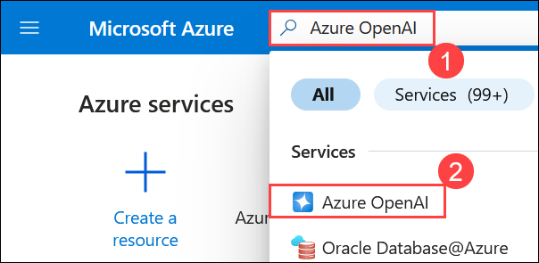

2. On the **Microsoft Foundry | Azure Open AI** page, ensure that **Azure OpenAI (1)** is selected from the left blade. Then, select **OpenAI-Lab01-<inject key="DeploymentID" enableCopy="false"></inject> (2)**

      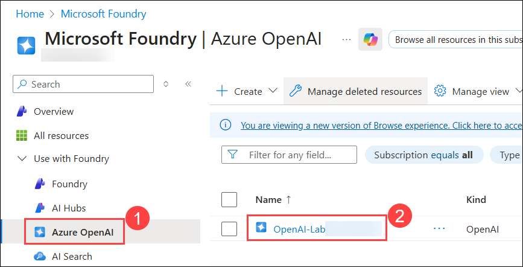

3. In the Azure OpenAI resource page, click on **Go to Foundry portal**, which will navigate to the **Microsoft Foundry**.

      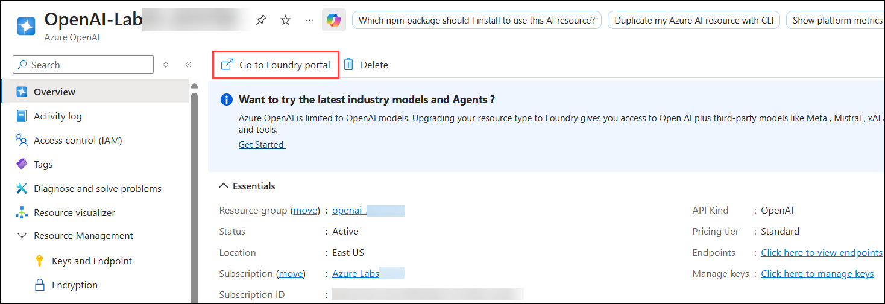

4. On the **Microsoft Foundry** portal, from the left navigation pane, select **Deployments (1)**. Then, click **+ Deploy Model (2)** and choose **Deploy Base Model (3)** from the drop-down.

      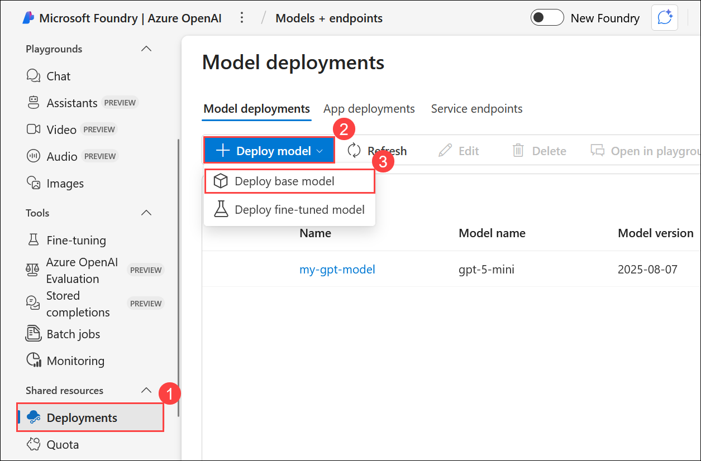

5. In the Select a model page, search for **gpt-image-1.5 (1)**, select **gpt-image-1.5 (2)** model, and click on **Confirm (3)**.

      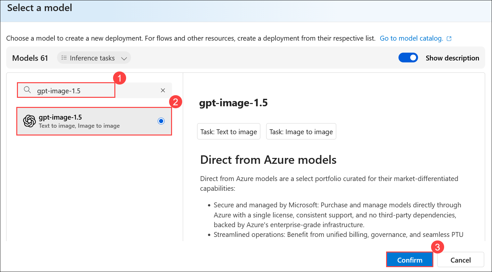

6. Within the **Deploy model** pop-up interface, enter the **Deployment name** as **gpt-image-model (1)** and Click on **Customize (2)** and make the **Request per Minute Rate Limit** to **`1` (3)** and click on **Create resource and deploy (4)**.

    >**Note:** Make sure that if your model is deployed to a new resource due to quota limitations (as shown in the images below), which is created during deployment, you will need to configure its Azure OpenAI endpoint and API key when using the REST API to generate images, else we can use the one's that we have used before.

      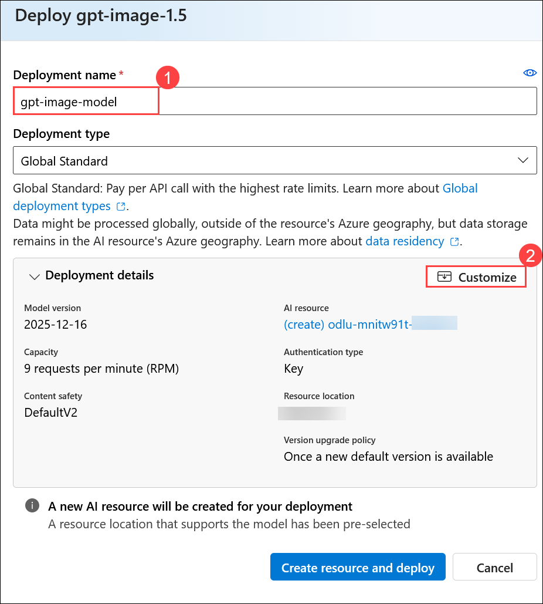

      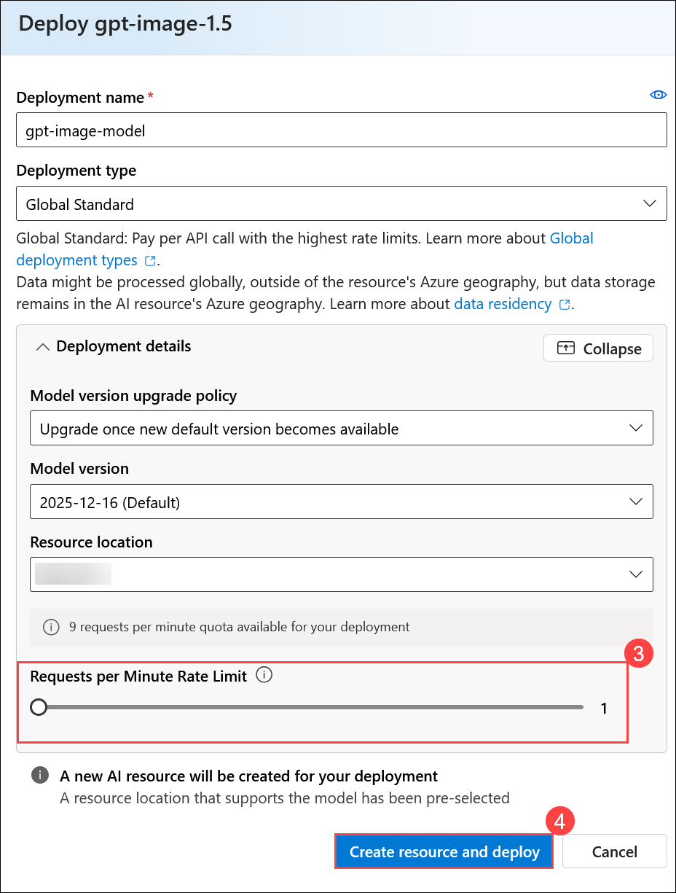
              
4. Once the model is deployed click on **Open in playground (1)** and then **Describe the image you want to generate (2)** box (for example, ``An elephant on a skateboard``), and then select **Generate (3)** to view the **Resulting Image (4)**.

    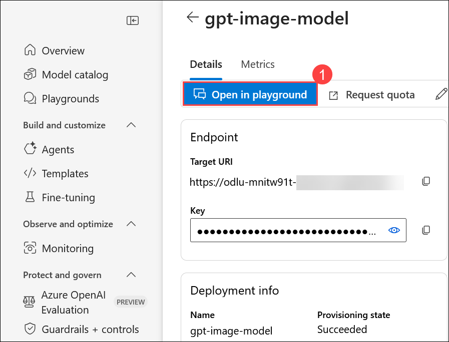

    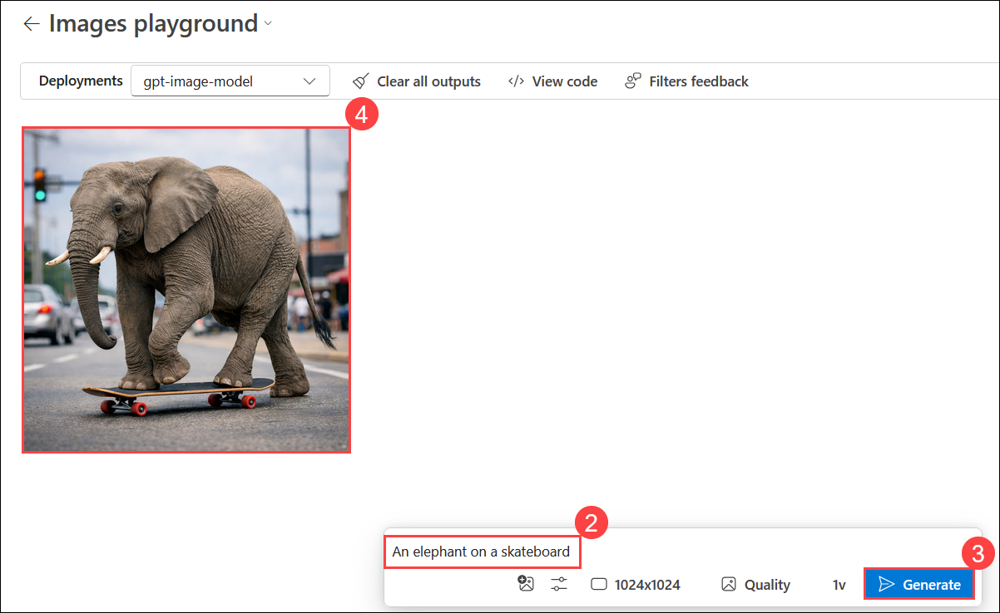

5. Modify the prompt to provide a more specific description. For example, ``An elephant on a skateboard in the style of Picasso`` **(1)**. Then **generate (2)** the new image and review the **results (3)**.

    > **Note:** If you hit any rate limit error please try again after 1 or 2 minutes. 

    > **Note:** The image may appear differently than shown in the screenshot. 

    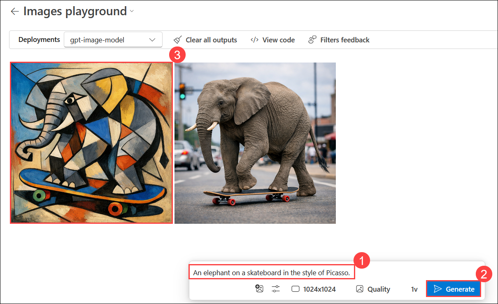

## Task 2: Use the REST API to generate images 

The Azure OpenAI service provides a REST API that you can use to submit prompts for content generation, including images generated by gpt-image-1.5 model.

### Task 2.1: Prepare the app environment

In this task, you will use a simple Python or C# app to generate images by calling the REST API and running the code in the Cloud Shell console interface within the Azure portal.

1. In the **Azure portal**, select the **[>_] (Cloud Shell)** button at the top of the page to the right of the search box. A Cloud Shell pane will open at the bottom of the portal. 

    

    > **Note:** If a **Cloud Shell timed out** pop-up appears, click **Reconnect**.

2. Make sure the type of shell indicated on the top left of the Cloud Shell pane is **Switch to PowerShell**. If it's *Switch to Bash*, select **Switch to Bash** and choose **Confirm** from the pop-up box.

    

3. Once the terminal opens, click on **Settings (1)** and select **Go to Classic version (2)**.

   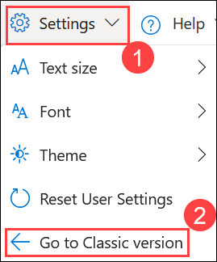

4. Navigate to the folder for the language of your preference by running the appropriate command.

    **C#**

    ```bash
    cd mslearn-openai/Labfiles/05-image-generation/CSharp
    ```

    **Python**

    ```bash
    cd mslearn-openai/Labfiles/05-image-generation/Python
    ```

6. Use the following command to open the built-in code editor and see the code files you will be working with.

    ```bash
   code .
    ```
   
### Task 2.2: Configure your application

In this task, you will use a configuration file in the application to store the details needed to connect to your Azure OpenAI service account.

1. In the code editor, select the configuration file for your app, depending on your language preference.

    - C#: `appsettings.json`
    - Python: `.env`
    
2. In the configuration file, enter the following values for your Azure OpenAI service:

    > **Note:** As mentioned earlier, if your model was deployed to a newly created resource during deployment, you’ll need to use its Azure OpenAI endpoint and API key. To find these, go to **Overview (1)** of newely created resource on foundry portal, select **Azure OpenAI (2)**, and copy the **Azure OpenAI endpoint (3)** and **API Key (4)**.

    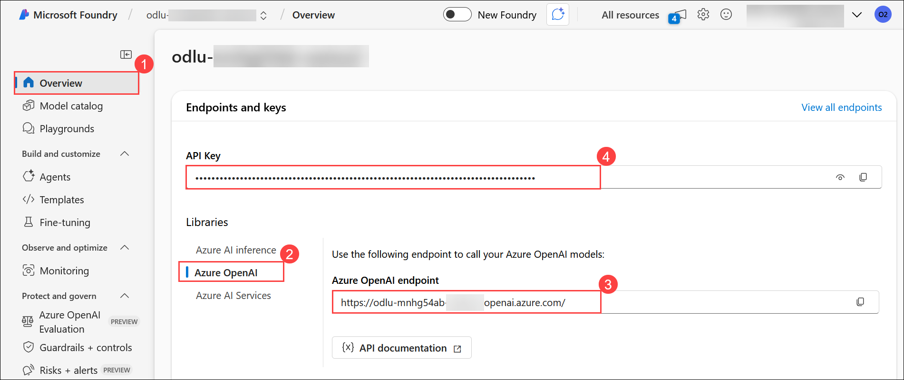

    - **Endpoint**: The endpoint URL from your Azure OpenAI resource.
    - **API Key**: The API key from your Azure OpenAI resource.
    - **Deployment Name**: Set this to **gpt-image-model** (the name of your image generation model deployment). After updating these values, press **CTRL + S** to save the file.

      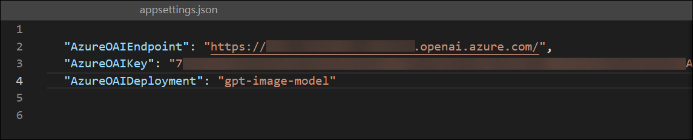

      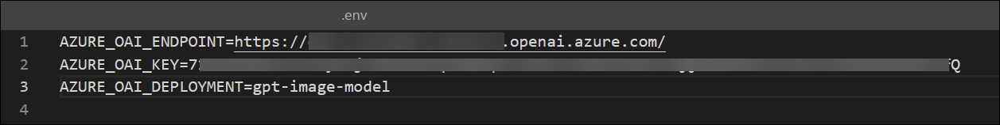

3. If you are using **Python**, you'll also need to install the **python-dotenv** package used to read the configuration file. In the console prompt pane, ensure the current folder is **~/mslearn-openai/Labfiles/05-image-generation/Python**. Then enter this command:

    ```bash
   pip install --user python-dotenv
    ```

1. If you're using **C#**, navigate to `generate_image.csproj`, delete the existing code, then replace it with the following code, and then press **Ctrl+S** to save the file.

    ```
    <Project Sdk="Microsoft.NET.Sdk">

    <PropertyGroup>
    <OutputType>Exe</OutputType>
    <TargetFramework>net8.0</TargetFramework>
    <ImplicitUsings>enable</ImplicitUsings>
    <Nullable>enable</Nullable>
    </PropertyGroup>

     <ItemGroup>
     <PackageReference Include="Azure.AI.OpenAI" Version="1.0.0-beta.14" />
     <PackageReference Include="Microsoft.Extensions.Configuration" Version="8.0.404" />
     <PackageReference Include="Microsoft.Extensions.Configuration.Json" Version="8.0.404" />
     </ItemGroup>

     <ItemGroup>
       <None Update="appsettings.json">
         <CopyToOutputDirectory>PreserveNewest</CopyToOutputDirectory>
        </None>
     </ItemGroup>

    </Project>
    ```    

     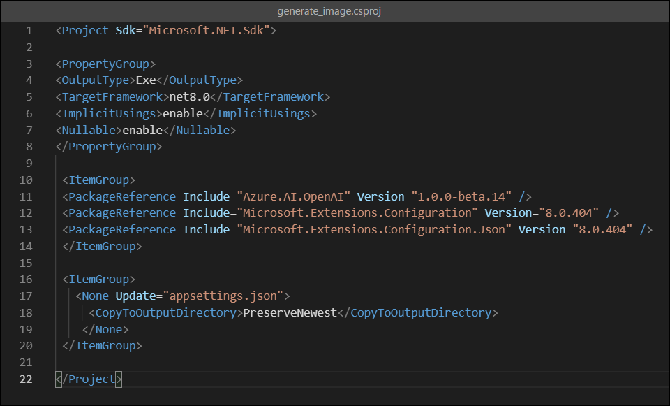    

1. Navigate to the folder for your preferred language and install the necessary packages.

    For **C#:**

    ```
    export DOTNET_ROOT=$HOME/.dotnet
    mkdir -p $DOTNET_ROOT
    ```

     >**Note:** Azure Cloud Shell often does not have admin privileges, so you need to install .NET in your home directory. So here you are creating a separate `.dotnet` directory under your home directory to isolate your configuration.
     - `DOTNET_ROOT` specifies where your .NET runtime and SDK are located (in your `$HOME/.dotnet directory`).
     - `mkdir -p $DOTNET_ROOT` This creates the directory where the .NET runtime and SDK will be installed.

1. Run the following command to install the required SDK version locally:     

    ```
    curl -fsSL https://dot.net/v1/dotnet-install.sh -o dotnet-install.sh
    chmod +x dotnet-install.sh
    ``` 

    ```
    ./dotnet-install.sh --channel 8.0 --install-dir $DOTNET_ROOT
    ```

    ```
    export PATH=$DOTNET_ROOT:$PATH
    ```

      >**Note:** These commands download and prepare the official `.NET` installation script, grant it execute permissions, and install the required .NET SDK version (8.0.404) in the `$DOTNET_ROOT` directory, as we don't have the admin privileges to install it globally.

1. Enter the following command to restore the workload.

    ```
    dotnet workload restore
    ```

     >**Note:** Restores any required workloads for your project, such as additional tools or libraries that are part of the .NET SDK.
    
1. Enter the following command to add the `Azure.AI.OpenAI` NuGet package to your project, which is necessary for integrating with Azure OpenAI services.

    ```
    dotnet add package Azure.AI.OpenAI --version 1.0.0-beta.14
    ```

1. For Python, run the following command to install the dependencies

    **Python**

    ```bash
   pip install --user requests
    ```

### Task 2.3: View application code

In this task, you will explore the code used to call the REST API and generate an image.

1. In the code editor pane, select the main code file for your application:

    - C#: `Program.cs`
    - Python: `generate-image.py`

2. Review the code that the file contains, noting the following key features:

    - The code sends HTTPS requests to your Azure OpenAI endpoint, using the service key from the configuration file in the request header.
    - The image generation workflow involves two REST API calls: the first initiates the image generation process, and the second retrieves the results.
    - The initial request includes:
      - The prompt provided by the user describing the desired image
      - The number of images to generate (set to 1)
      - The desired image resolution
    - The response to the initial request contains an **operation-location** header, which provides a callback URL for polling the status of the image generation.
    - The code repeatedly polls the callback URL until the image generation status is *succeeded*, then extracts and displays the URL of the generated image.

## Task 3: Run the app

In this task, you will run the reviewed code to generate some images.

1. In the **Cloudshell** bash terminal, navigate to the folder for your preferred language.

2. In the console prompt pane, enter the appropriate command to run your application:

    **C#**

    ```bash
   dotnet run
    ```

    **Python**

    ```bash
    python generate-image.py
    ```
3. When prompted, enter a description for an image. For example, `A giraffe flying a kite` **(1)**.
    
4. Wait for the image to be generated—you’ll see a success message indicating that the image has been saved. **Copy (2)** the image name, then run the command ``download <image name>`` **(3)**. A **pop-up (4)** will appear at the bottom-right of the Cloud Shell; click it to download and view the generated image. opnfiledwn

    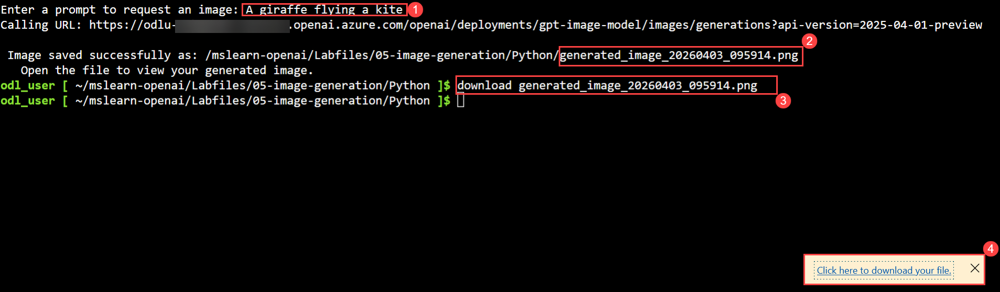

    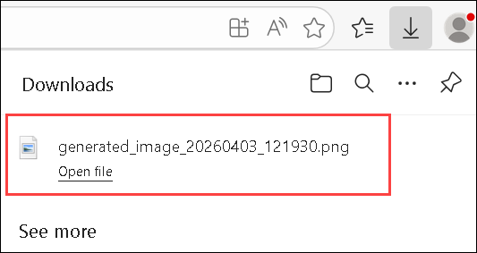

    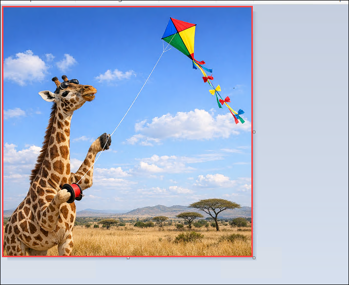

5. Close the tab containing the generated image and re-run the app to generate a new image with a different prompt.

## Summary

In this lab, you explored the gpt-image-1.5 playground in the Azure Microsoft Foundry portal to generate images based on natural language prompts. You also examined a simple application that uses the REST API to generate images with a gpt-image-1.5 model and ran the application in the Cloud Shell console within the Azure portal.

### You have successfully completed the lab. Click on **Next >>** to proceed with the next lab.
     
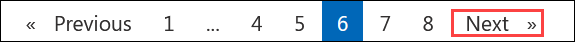
