# Lab 06: Add your data for RAG with Azure OpenAI Service

## Estimated Duration: 75 Minutes

## Lab Overview

In this lab, you will learn how to connect your own data to the Azure OpenAI Service for Retrieval-Augmented Generation (RAG).

The Azure OpenAI Service enables you to use your own data with the intelligence of the underlying LLM. You can limit the model to only use your data for pertinent topics or blend it with results from the pre-trained model.

## Lab Objectives

In this lab, you will complete the following tasks:

- Task 1: Observe normal chat behavior without adding your own data
- Task 2: Create an assistant and connect your data
- Task 3: Chat with a model grounded in your data
- Task 4: Set up an application in Cloud Shell
- Task 5: Configure your application
- Task 6: Run your application

## Task 1: Observe normal chat behavior without adding your own data

In this task, you will observe how the base model responds to queries without any grounding data.

1. Navigate to [Microsoft Foundry](https://ai.azure.com/) portal.

1. From the left navigation pane, select **Chat (1)** and ensure that your model deployment **my-gpt-model (2)** is selected.

   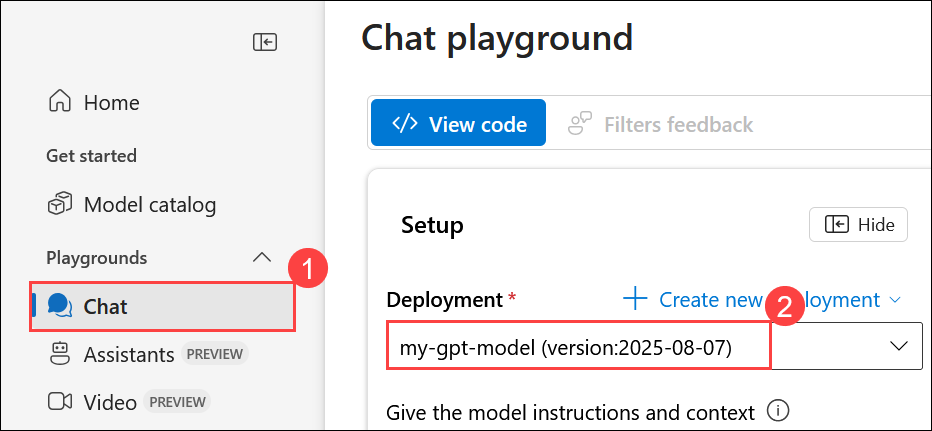

1. In the **Setup** area, for the **Give the model instructions and context (1)**, provide the following message and click on **Apply changes (2)**.

   > **Note:** If the Apply changes button is greyed out, it means this instruction is already set — no further action is needed.

    ```
    You are an AI assistant that helps people find information.
    ```

   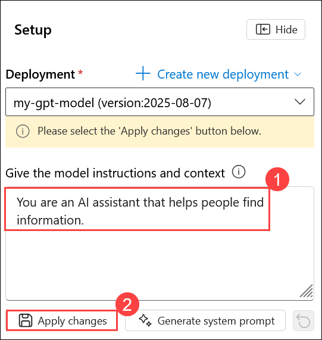

1. In the **Update system message?** window, click on **Continue**.

      

1. In the **Chat session** on the right side, submit the following queries, and review the responses:

    ```
    I'd like to take a trip to New York. Where should I stay?
    ```

   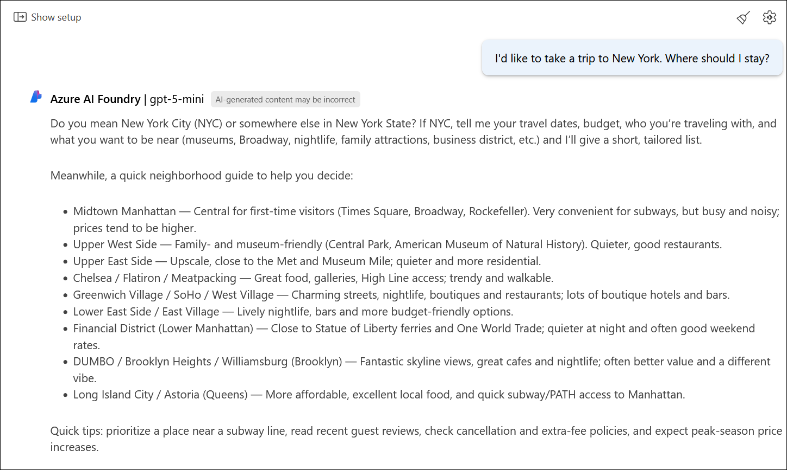

    ```
    What are some facts about New York?
    ```

   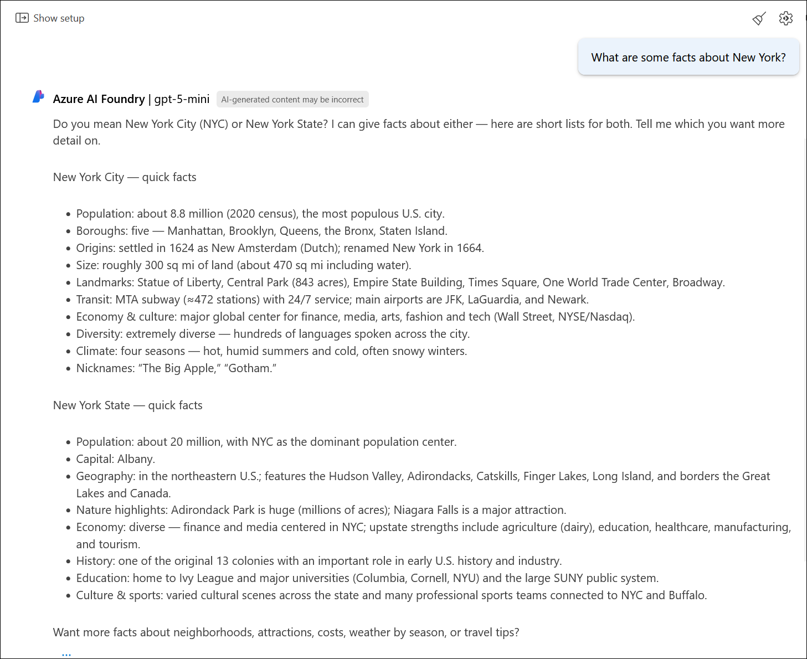

    Try similar questions about tourism and places to stay for other locations that will be included in our grounding data, such as London or San Francisco. You'll likely get complete responses about areas or neighbourhoods, and some general facts about the city.

## Task 2: Create an assistant and connect your data

In this task, you will create an assistant that will  responds to queries with grounding data.

1. From the left navigation pane click on **Assistants (1)**, under Deployment select your model **my-gpt-model (2)** and then click on **+ Create an assistant (3)**.    

    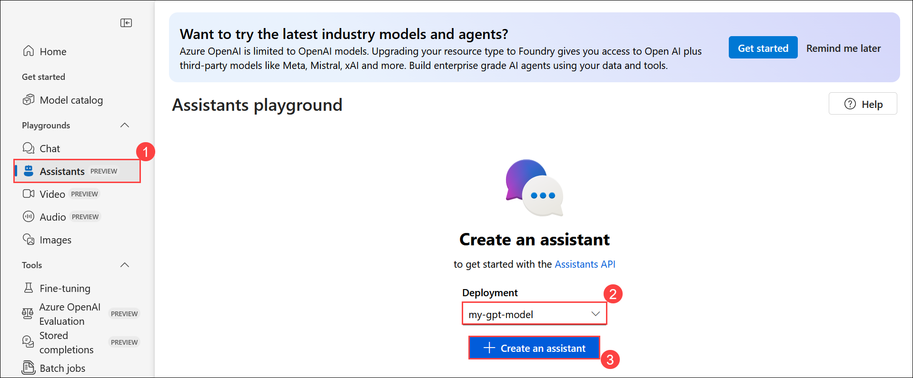

1. Enter Assistant name as ``my-gpt-assistant`` **(1)** and ensure **my-gpt-model (2)** is selected under Deployments. Under **Tools** section enable **File Search (3)** and click on **+ Add Vector store (4)**

    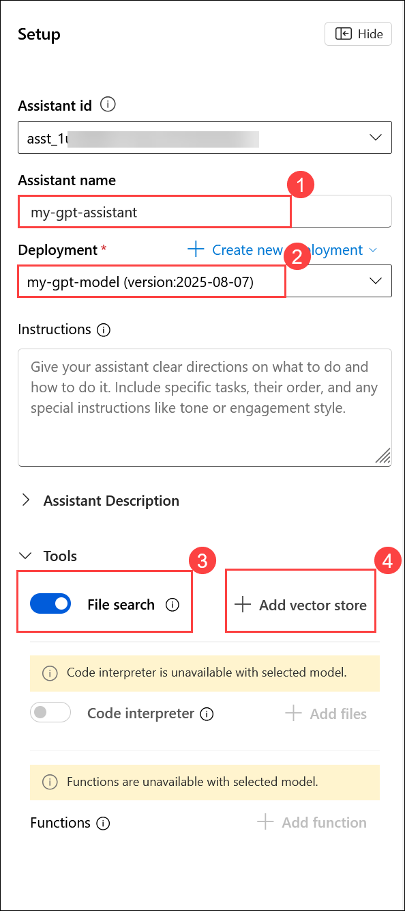

1. On the **Attach files to the assistant file search** click on **Select local files**.

    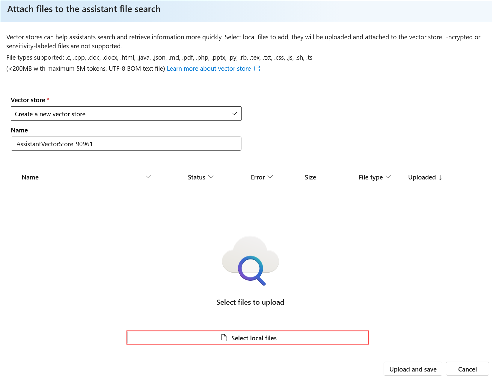

1. Now Search for navigate to `C:\AllFiles\mslearn-openai-main\Labfiles\06-use-own-data\data` **(1)**. Select all the **PDF files (2)** and click on **Open (3)**.

    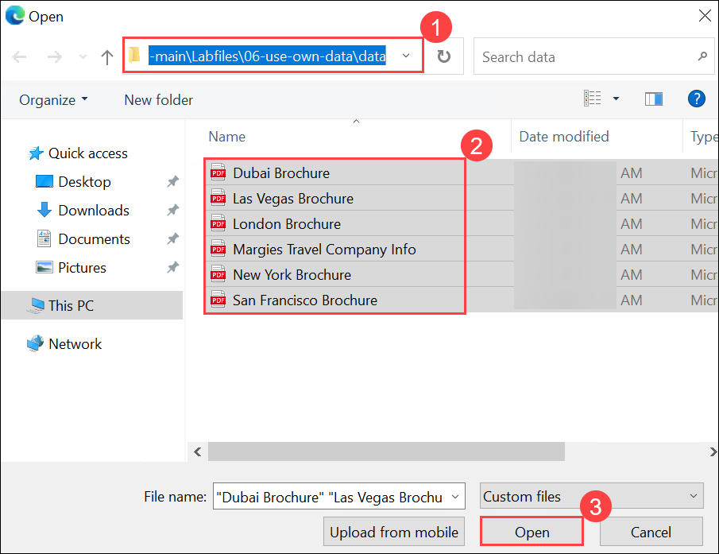

1. To upload the files click on **Upload and save** on the **Attach files to the assistant file search** page.

    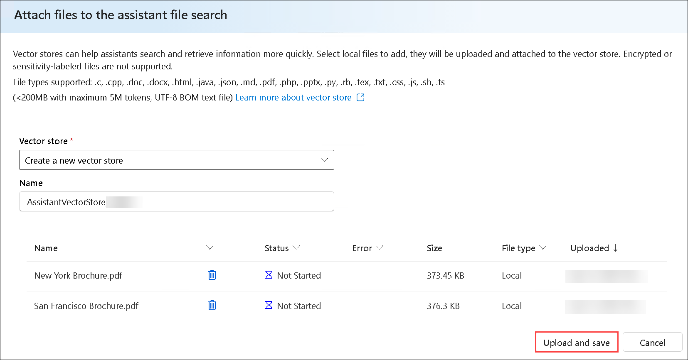

1. Now your Vector store will appear under **Files search (1)** section and also copy the **Assistant id (2)** and save in a notepad for later use.

    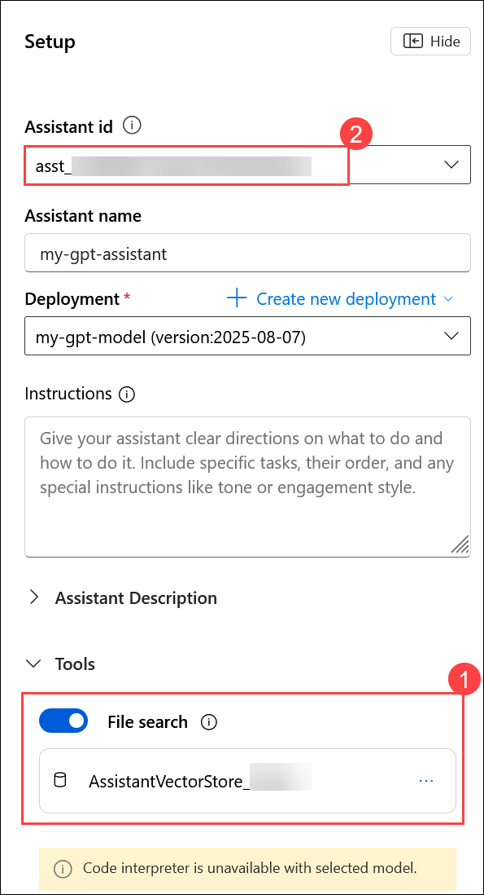

## Task 3: Chat with a model grounded in your data

In this task, you will ask the same questions as before in the chat section after adding your data, and observe how the responses differ.

1. In the **Chat** session on the right side, submit the following queries, and review the responses:

   ```
   I'd like to take a trip to New York. Where should I stay?
   ```

   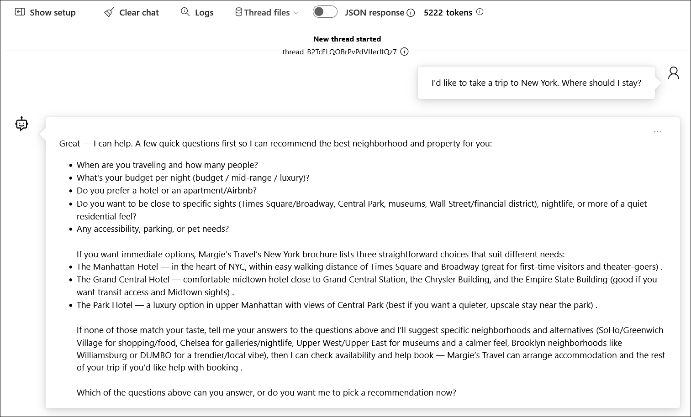 

   ```
   What are some facts about New York?
   ```

   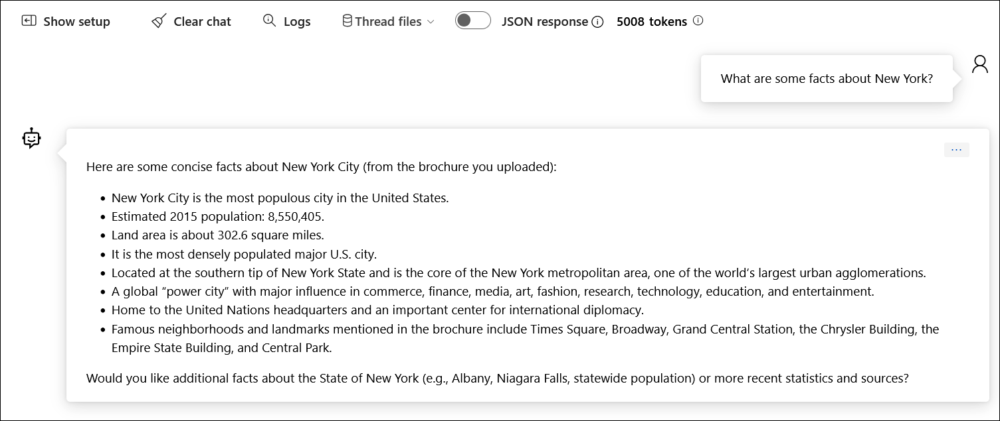 

2. You'll notice a very different response this time, with specifics about certain hotels, as well as references to where the information provided came from. If you open the PDF reference listed in the response, you'll see the same hotels as the model provided. Try asking it about other cities included in the grounding data, which are Dubai, Las Vegas, London, and San Francisco.

    >**Note:** It is still in preview and might not always behave as expected for this feature, such as giving the incorrect reference for a city not included in the grounding data.

## Task 4: Set up an application in Cloud Shell

In this task, you will use a short command-line application running in Cloud Shell on Azure to demonstrate integration with an Azure OpenAI model. Open a new browser tab to access Cloud Shell.

1. In the **Azure portal**, select the **[>_] (Cloud Shell)** button at the top of the page to the right of the search box. A Cloud Shell pane will open at the bottom of the portal.

      

2. Make sure the type of shell indicated on the top left of the Cloud Shell pane is **Switch to PowerShell**. If it's *Bash*, select **Switch to Bash** and choose **Confirm** from the pop-up box.

    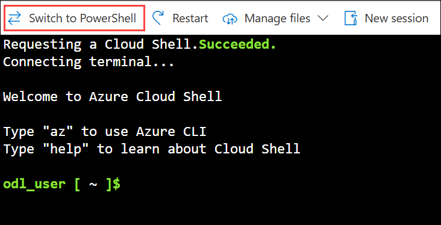

3. Once the terminal opens, click on **Settings (1)** and select **Go to Classic version (2)**.

   

4. In the cloud shell pane, enter the following commands to clone the GitHub repo containing the code files for this exercise.

     ```
     rm -r mslearn-openai -f
     git clone https://github.com/microsoftlearning/mslearn-openai mslearn-openai
     ```

5. After the repo has been cloned, navigate to the folder containing the chat application code files.
   
    ```bash
    cd mslearn-openai/Labfiles/02-use-own-data
    ```

    Applications for both C# and Python have been provided, as well as sample code we'll be using in this lab.

5. Open the built-in code editor, and you can observe the code files we'll be using in `sample-code`. Use the following command to open the lab files in the code editor.

    ```bash
   code .
    ```

## Task 5: Configure your application

In this task, you will complete key parts of the application to enable it to use your Azure OpenAI resource.

1. In the code editor, expand the language folder for your preferred language.

1. Open the configuration file for your language and update the code.

    - **C#**: `appsettings.json`

        ```json
        {
        "AzureOAIEndpoint": "Your OpenAI endpoint",
        "AzureOAIKey": "Azure OpenAI Key",
        "AssistantId": "Id of your Assistant"
        }
        ```

    - **Python**: `.env`

        ```
        AZURE_OAI_ENDPOINT=<Your OpenAI endpoint>
        AZURE_OAI_KEY=<Azure OpenAI Key>
        ASSISTANT_ID=<Id of your Assistant>
        ```

1. Update the configuration file for your chosen language with the following values:

    - **Azure OpenAI endpoint**: Paste the endpoint URL from your Azure OpenAI resource (found on the Keys and Endpoint page in the Azure portal).
    - **Azure OpenAI key**: Paste the key from your Azure OpenAI resource (also on the Keys and Endpoint page).
    - **AssistantId**: Enter the ID of your assistant that you created in Task 2.
    - Save your changes after updating these values.

        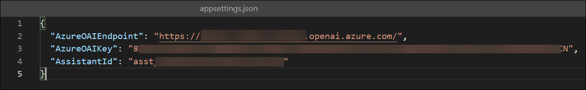

        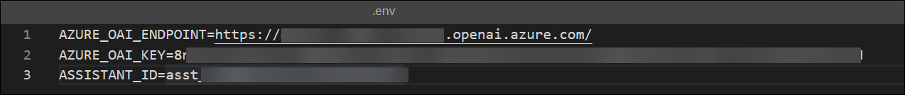

1. If you're using **C#**, navigate to `CSharp.csproj`, delete the existing code, then replace it with the following code, and then press **Ctrl+S** to save the file.

    ```
    <Project Sdk="Microsoft.NET.Sdk">

    <PropertyGroup>
        <OutputType>Exe</OutputType>
        <TargetFramework>net8.0</TargetFramework>
        <ImplicitUsings>enable</ImplicitUsings>
        <Nullable>enable</Nullable>
        <LangVersion>12</LangVersion>
    </PropertyGroup>

    <ItemGroup>
        <PackageReference Include="Azure.AI.OpenAI" Version="2.1.0" />
        <PackageReference Include="Azure.Search.Documents" Version="11.6.0" />
        <PackageReference Include="Microsoft.Extensions.Configuration" Version="8.0.0" />
        <PackageReference Include="Microsoft.Extensions.Configuration.Json" Version="8.0.0" />
        <PackageReference Include="Newtonsoft.Json" Version="13.0.3" />
    </ItemGroup>

    <ItemGroup>
        <None Update="appsettings.json">
        <CopyToOutputDirectory>PreserveNewest</CopyToOutputDirectory>
        </None>
    </ItemGroup>

    </Project>
    ```    

     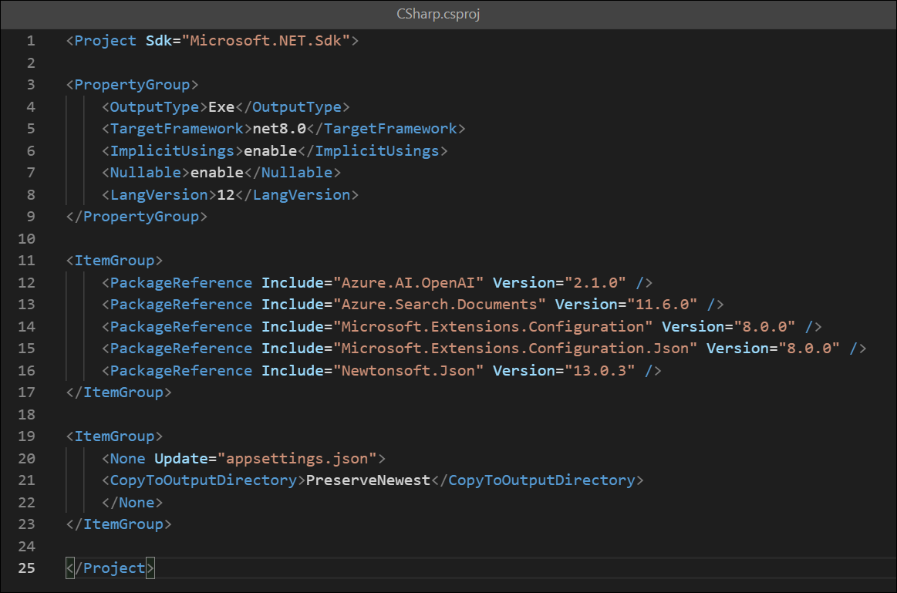    

1. Navigate to the **CSharp** folder and install the necessary packages. These commands set up the environment for a local installation of the .NET SDK in Cloud Shell.

   For **C#:**

    ```
    cd CSharp
    ```

    ```
    export DOTNET_ROOT=$HOME/.dotnet
    mkdir -p $DOTNET_ROOT
    ```

     >**Note:** Azure Cloud Shell often does not have admin privileges, so you need to install .NET in your home directory. So here you are creating a separate `.dotnet` directory under your home directory to isolate your configuration.
     - `DOTNET_ROOT` specifies where your .NET runtime and SDK are located (in your `$HOME/.dotnet directory`).
     - `mkdir -p $DOTNET_ROOT` This creates the directory where the .NET runtime and SDK will be installed.

1. Run the following command to install the required SDK version locally:     

    ```
    curl -fsSL https://dot.net/v1/dotnet-install.sh -o dotnet-install.sh
    chmod +x dotnet-install.sh
    ``` 

    ```
    ./dotnet-install.sh --channel 8.0 --install-dir $DOTNET_ROOT
    ```

    ```
    export PATH=$DOTNET_ROOT:$PATH
    ```

1. Enter the following command to restore any required workloads for your project, such as additional tools or libraries that are part of the .NET SDK.

    ```
    dotnet workload restore
    ```

1. Enter the following command to add the `Azure.AI.OpenAI` NuGet package to your project, which is necessary for integrating with Azure OpenAI services.

    ```
    dotnet add package Azure.AI.OpenAI --version 2.1.0
    dotnet add package Azure.Search.Documents --version 11.6.0
    ```

    ```
    dotnet add package Azure.AI.OpenAI --prerelease
    dotnet add package OpenAI --prerelease
    ```

1. If you prefer **Python**, navigate to the **Python** folder and install the necessary packages using the commands below:

    ```
    cd Python
    python -m venv labenv
    ./labenv/bin/Activate.ps1
    pip install --user python-dotenv openai==1.65.2
    ```

1. In the code editor, replace your entire file code.

    For **C#**: OwnData.cs

    ```csharp
    using System.ClientModel;
    using Microsoft.Extensions.Configuration;

    using Azure.AI.OpenAI;
    using OpenAI.Assistants;
    using OpenAI;

    #pragma warning disable OPENAI001

    // Get configuration settings  
    IConfiguration config = new ConfigurationBuilder()
        .AddJsonFile("appsettings.json")
        .Build();

    string oaiEndpoint = config["AzureOAIEndpoint"] ?? "";
    string oaiKey = config["AzureOAIKey"] ?? "";
    string assistantId = config["AssistantId"] ?? "";

    // Initialize client
    AzureOpenAIClient azureClient = new(new Uri(oaiEndpoint), new ApiKeyCredential(oaiKey));
    AssistantClient assistantClient = azureClient.GetAssistantClient();

    // Get input
    Console.WriteLine("Enter a question:");
    string text = Console.ReadLine() ?? "";

    // Create thread
    var thread = assistantClient.CreateThread().Value;

    // Add message
    assistantClient.CreateMessage(
        thread.Id,
        MessageRole.User,
        new[] { MessageContent.FromText(text) }
    );

    // Run assistant (UPDATED)
    var run = assistantClient.CreateRun(thread.Id, assistantId).Value;

    // Wait for completion
    while (run.Status == RunStatus.Queued || run.Status == RunStatus.InProgress)
    {
        Thread.Sleep(1000);
        run = assistantClient.GetRun(thread.Id, run.Id).Value;
    }

    // Get messages
    var messages = assistantClient.GetMessages(thread.Id);

    // Print response
    foreach (var msg in messages)
    {
        if (msg.Role == MessageRole.Assistant)
        {
            Console.WriteLine(msg.Content[0].Text);
        }
    }
    ```

    For **Python**: ownData.py

    ```python
    import os
    from openai import AzureOpenAI
    import dotenv
    import time

    dotenv.load_dotenv()

    endpoint = os.environ.get("AZURE_OAI_ENDPOINT")
    api_key = os.environ.get("AZURE_OAI_KEY")
    assistant_id = os.environ.get("ASSISTANT_ID")

    client = AzureOpenAI(
        azure_endpoint=endpoint,
        api_key=api_key,
        api_version="2024-05-01-preview"
    )

    # Get user input
    text = input('\nEnter a question:\n')

    # Create thread
    thread = client.beta.threads.create()

    # Add message
    client.beta.threads.messages.create(
        thread_id=thread.id,
        role="user",
        content=text
    )

    # Run assistant
    run = client.beta.threads.runs.create(
        thread_id=thread.id,
        assistant_id=assistant_id
    )

    # Wait for completion
    while run.status in ["queued", "in_progress"]:
        time.sleep(1)
        run = client.beta.threads.runs.retrieve(
            thread_id=thread.id,
            run_id=run.id
        )

    # Get messages
    messages = client.beta.threads.messages.list(thread_id=thread.id)

    # Print response
    for msg in messages.data:
        if msg.role == "assistant":
            print("\nAssistant:", msg.content[0].text.value)
    ```


1. Save the changes to the code file.

## Task 6: Run your application

In this task, you will run your configured app to send a request to your model and observe the response, noting that the only difference between options is the prompt content while all other parameters (such as token count and temperature) remain consistent.

In this task, you will run the reviewed code to generate some images.

1. In the **Cloudshell** bash terminal, navigate to the folder for your preferred language.

2. In the interactive terminal pane, ensure the folder context is the folder for your preferred language. Then enter the following command to run the application.

    - **C#**: `dotnet run`
    - **Python**: `python ownData.py`

        >**Note**: If you encounter any errors after running the Python script, try upgrading the OpenAI package by running the following command:
        
        ```
        pip install --user --upgrade openai
        ```

3. Review the response to the prompt `Tell me about London`, which should include an answer as well as some details of the data used to ground the prompt, which was obtained from your search service.

    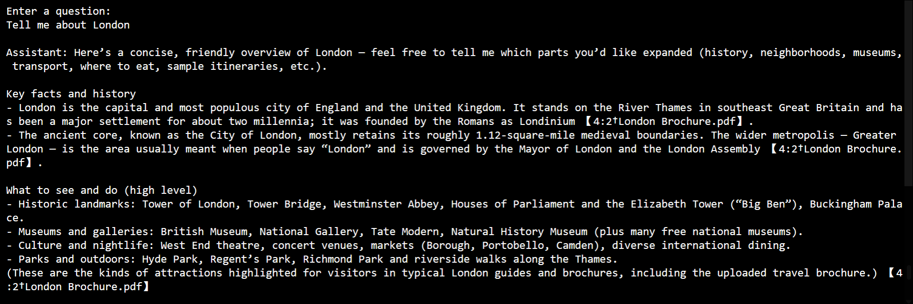

## Summary

In this lab, you began by evaluating how an Azure OpenAI model responds without grounding data to understand its baseline behavior. You then created an assistant with file search capabilities and connected it to a vector store containing your custom data, enabling grounded responses. By comparing outputs before and after grounding, you observed how Retrieval-Augmented Generation (RAG) improves the relevance and accuracy of responses. You also set up a development environment in Azure Cloud Shell, explored the provided application code, and configured it with your Azure OpenAI credentials and assistant details. Finally, you executed the application to interact programmatically with a grounded AI model, completing an end-to-end implementation of a RAG-based solution.

### You have successfully completed the lab. Click on **Next >>** to proceed with the next lab.
     

