# Lab 04: Generate and improve code with Azure OpenAI Service

## Estimated Duration: 60 Minutes

## Lab Overview
In this lab, you will learn how to use Azure OpenAI Service to generate, explain, and improve code using natural language prompts. You will explore code generation in the chat playground and integrate OpenAI into your app to automate code tasks. This will help you enhance productivity by simplifying coding and debugging processes.

The Azure OpenAI Service models can generate code for you using natural language prompts, fixing bugs in completed code, and providing code comments. These models can also explain and simplify existing code to help you understand what it does and how to improve it.

## Lab Objectives
In this lab, you will complete the following tasks:

- Task 1: Provision an Azure OpenAI resource
- Task 2: Deploy a model
- Task 3: Generate code in the chat playground
- Task 4: Set up an application in Cloud Shell
- Task 5: Configure your application
- Task 6: Run your application

## Task 1: Provision an Azure OpenAI resource

In this task, you'll create an Azure resource in the Azure portal, selecting the OpenAI service and configuring settings such as region and pricing tier. This setup allows you to integrate OpenAI's advanced language models into your applications.

1. In the **Azure portal**, search for **Azure OpenAI (1)** and select **Azure OpenAI (2)** from the results.

   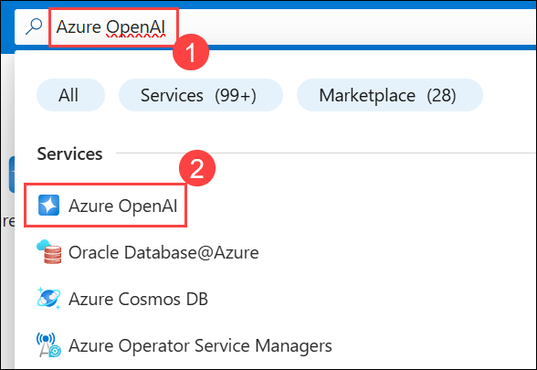

2. On  **AI Foundary | Azure OpenAI** blade, select **Azure OpenAI (1)** from the left menu, click on **+ Create (2)** and select **Azure OpenAI (3)**

   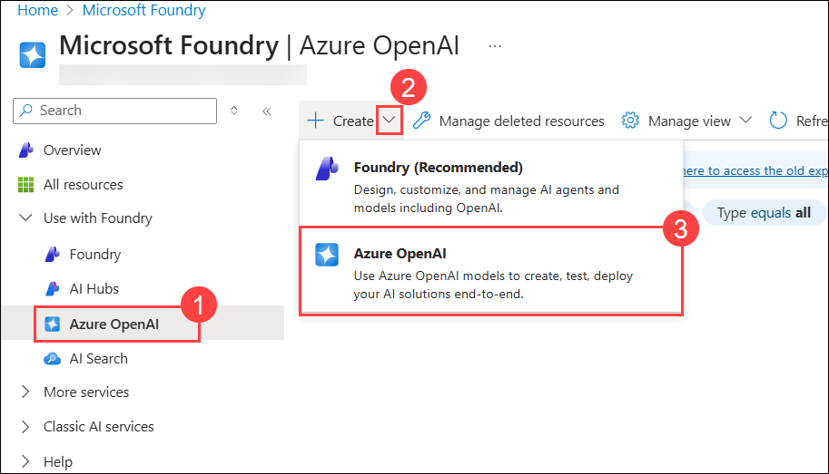

3. Create an **Azure OpenAI** resource using the settings below, then click **Next (6)** three times, leaving all other options at their defaults.
    
    - Subscription: **Default Subscription (1)**
    
    - Resource group: **openai-<inject key="Deployment-id" enableCopy="false"></inject> (2)**
    
    - Region: **<inject key="Region" enableCopy="false"></inject> (3)**
    
    - Name: **OpenAI-Lab04-<inject key="Deployment-id" enableCopy="false"></inject> (4)**
    
    - Pricing tier: **Standard S0 (5)**
  
      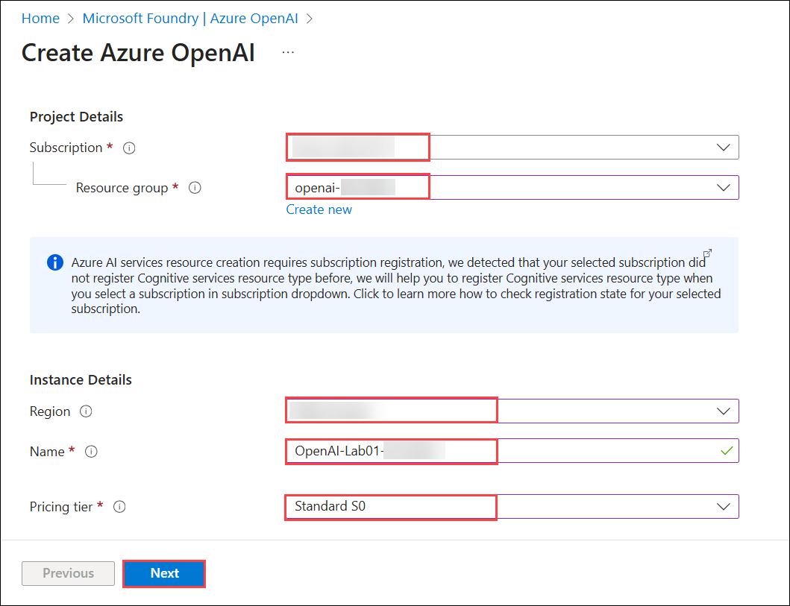

4. Under the **Review + submit** tab, click on **Create**.

      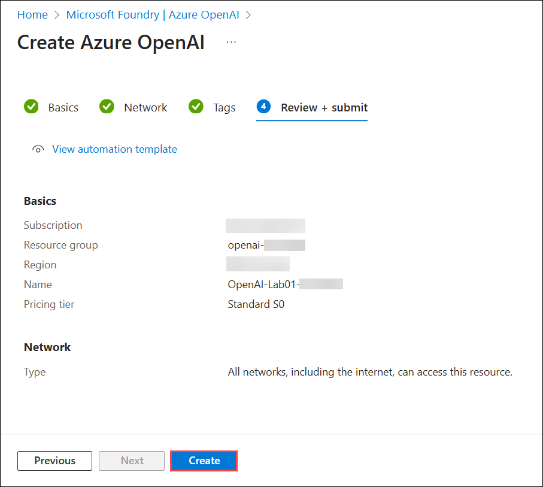

5. Wait for deployment to complete. Click on **Go to resource** to navigate to the deployed Azure OpenAI resource in the Azure portal.

      

6. To capture the Keys and Endpoints values, on **openai-<inject key="Deployment-ID" enableCopy="false"></inject>** blade:
      - Select **Keys and Endpoint (1)** under **Resource Management**.
      - Click on **Show Keys (2)**.
      - Copy **Key 1 (3)** and ensure to paste it in a text editor such as notepad for future reference.
      - Finally copy the **Endpoint (4)** API URL by clicking on copy to clipboard. Paste it in a text editor such as notepad for later use.

           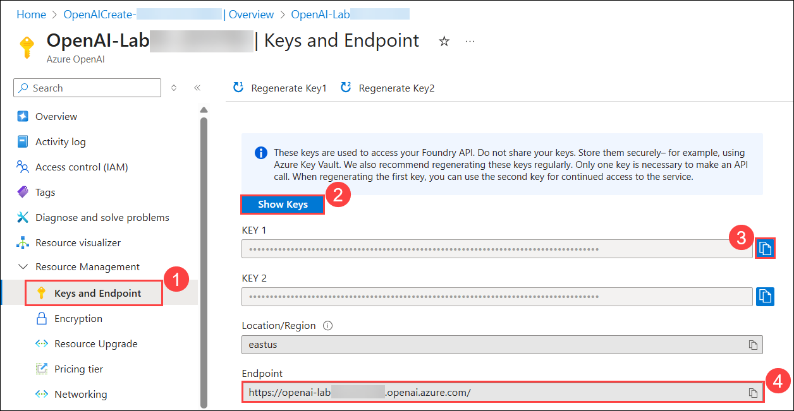    

## Task 2: Deploy a model 

In this task, you'll deploy a specific AI model instance within your Azure OpenAI resource to integrate advanced language capabilities into your applications.

1. In the Azure OpenAI resource pane, click on **Go to Foundry portal**, which will navigate to **Microsoft Foundry**.

    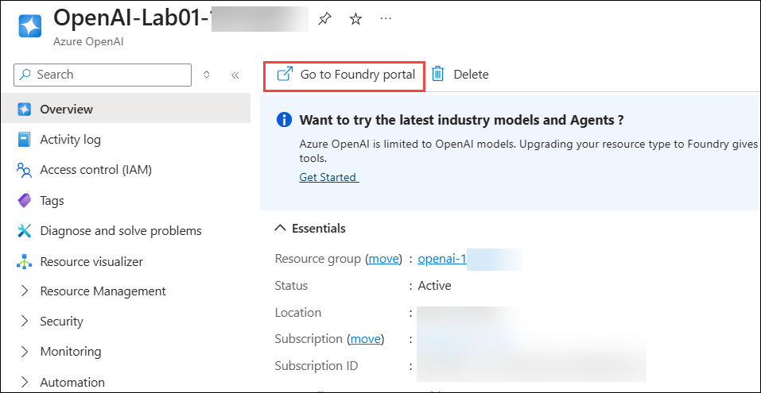

1. Select the **Deployments (1)** from the left pane, click on **+ Deploy model (2)** and choose **Deploy base model (3)**.

    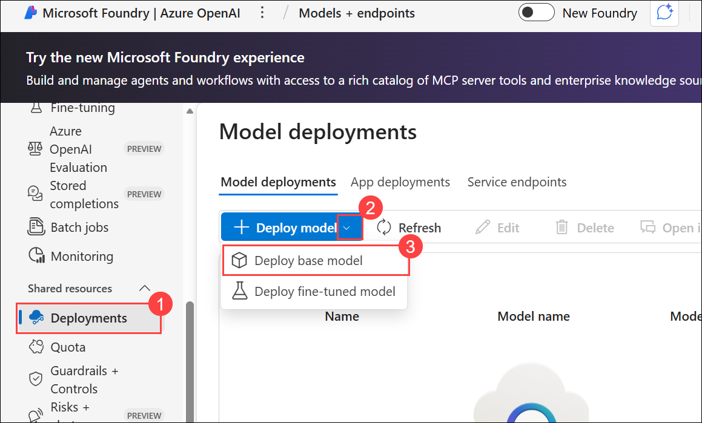

1. Search for **gpt-4.1-mini (1)** in the search bar, select **gpt-4.1-mini (2)** and click on **Confirm (3)**.

   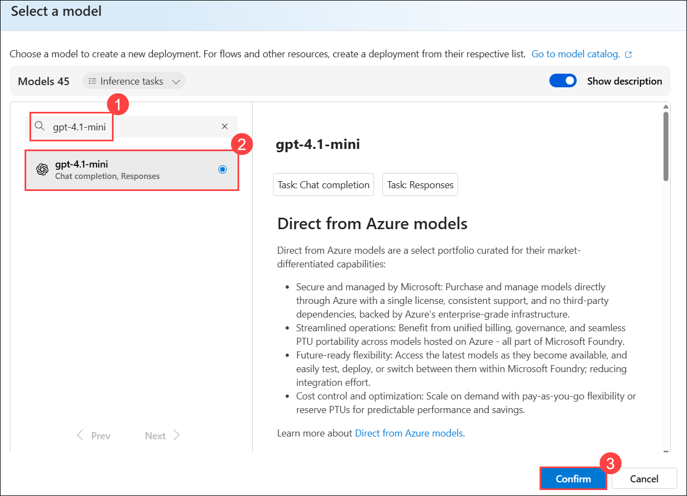 

   >**Note:** If pop-up window **Unlock the full capabilities of Azure Microsoft Foundry with projects** appears, click **Continue with existing setup**

      .png)
   
1. Within the **Deploy model gpt-4.1-mini** pop-up interface, click on **Customize**.

   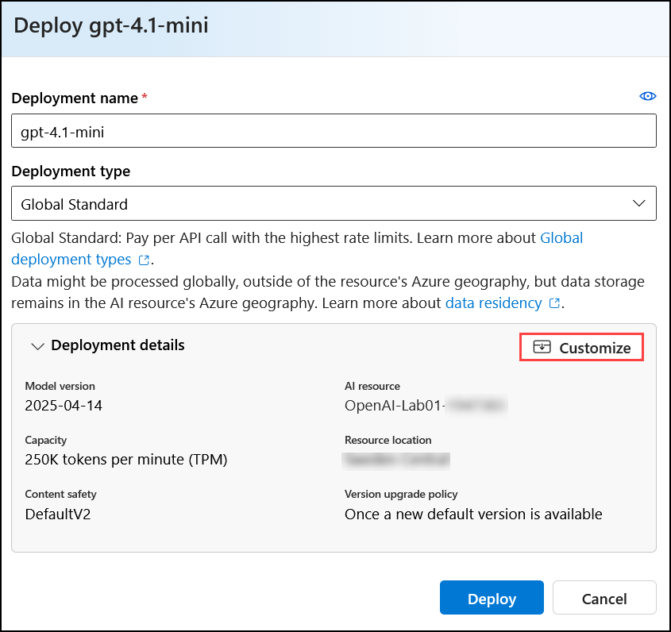

1. Within the **Deploy model gpt-4.1-mini** pop-up interface, enter the following details:

      - Deployment name: **my-gpt-model (1)**

      - Deployment type: **Global Standard (2)**

      - Model version: **2025-04-14 (Default) (3)**

      - Tokens per Minute Rate Limit (thousands): In between **10K - 13K (4)**

      - Content filter: **DefaultV2 (5)**

      - Click on **Deploy (6)**

        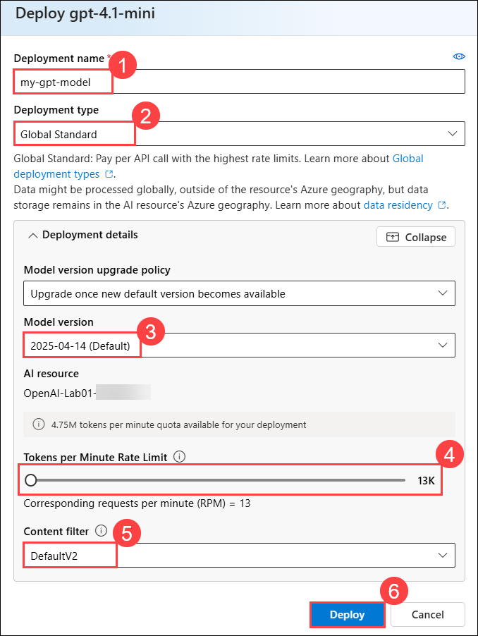
      
1. This will deploy a model that you will be playing around with as you proceed.

    > **Note:** You can ignore any error related to the assignment of roles to view the quota limits.
   
    > **Note:** Azure OpenAI includes multiple models, each optimized for a different balance of capabilities and performance. In this exercise, you'll use the **gpt-4.1-mini** model, which is a good model for summarizing and generating natural language and code. For more information about the available models in Azure OpenAI, see [Models](https://learn.microsoft.com/azure/cognitive-services/openai/concepts/models) in the Azure OpenAI documentation.

## Task 3: Generate code in chat playground

In this task, you will examine how Azure OpenAI can generate and explain code in the Chat playground before using it in your app.

1. Navigate back to [Microsoft Foundry](https://ai.azure.com/) portal, from the left navigation pane, select **Chat (1)** and verify that the **my-gpt-model (2)** model is selected in the Deployment.

   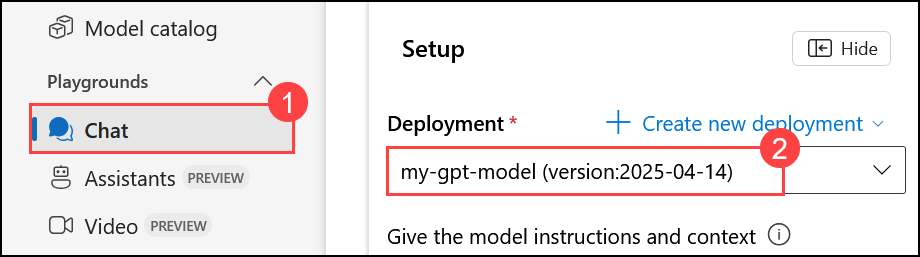
   
1. In the **Chat session** section, enter the following prompt and press *Enter*.

    ```code
    Write a function in Python that takes a character and a string as input, and returns how many times that character appears in the string
    ```
    
   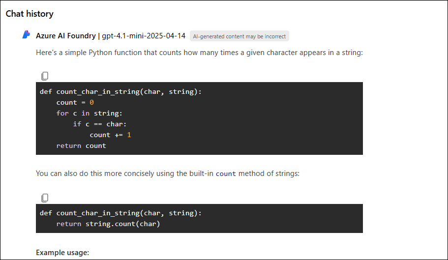

1. Observe the output. The model will likely respond with a function, with some explanation of what the function does and how to call it.

1. Next, send the prompt:
   ```
   Do the same thing, but this time write it in C#.
   ```

   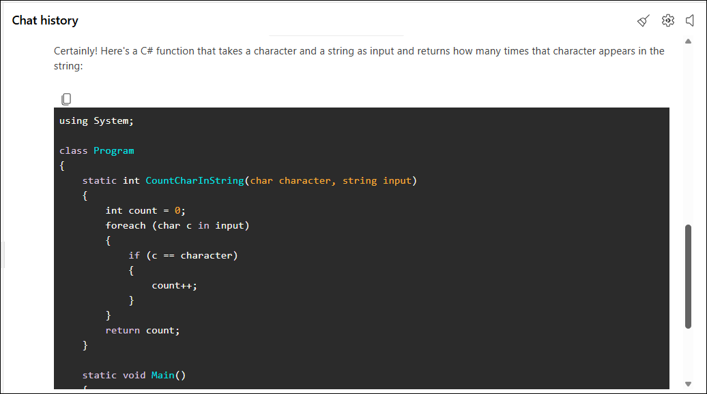

1. Observe the output. The model likely responded very similarly as the first time, but this time coding in C#. You can ask it again for a different language of your choice, or a function to complete a different task, such as reversing the input string.

1. Next, let's explore using AI to understand code with this example of a random function you saw written in Ruby. Send the following prompt as the user query.

    ```code
    What does the following function do?  
    ---  
    def random_func(n)
      start = [0, 1]
      (n - 2).times do
        start << start[-1] + start[-2]
      end
      start.shuffle.each do |num|
        puts num
      end
    end
    ```

   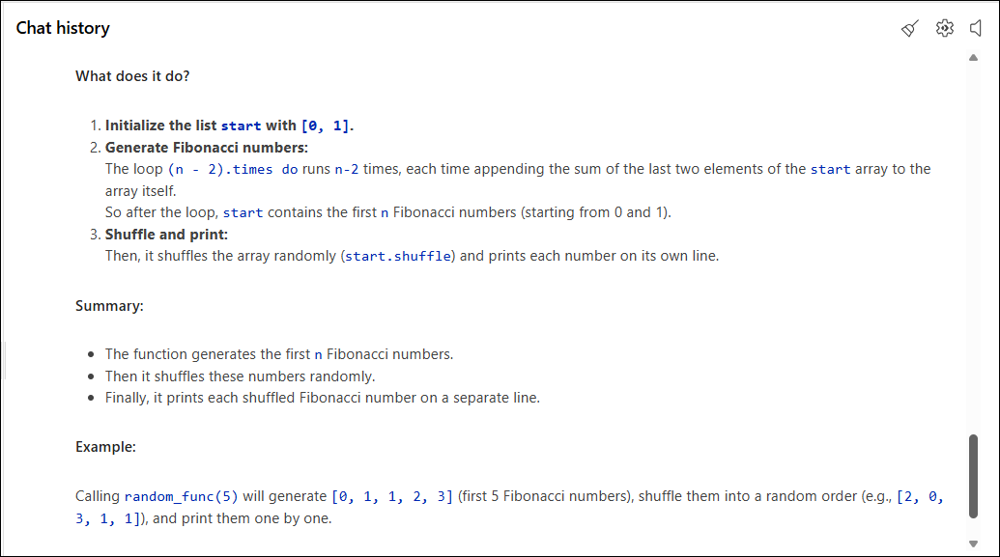

1. Observe the output, which explains what the function does.

1. Submit the following prompt to get a simpler version of the function.

   ```
   Can you simplify the function?
   ```   

   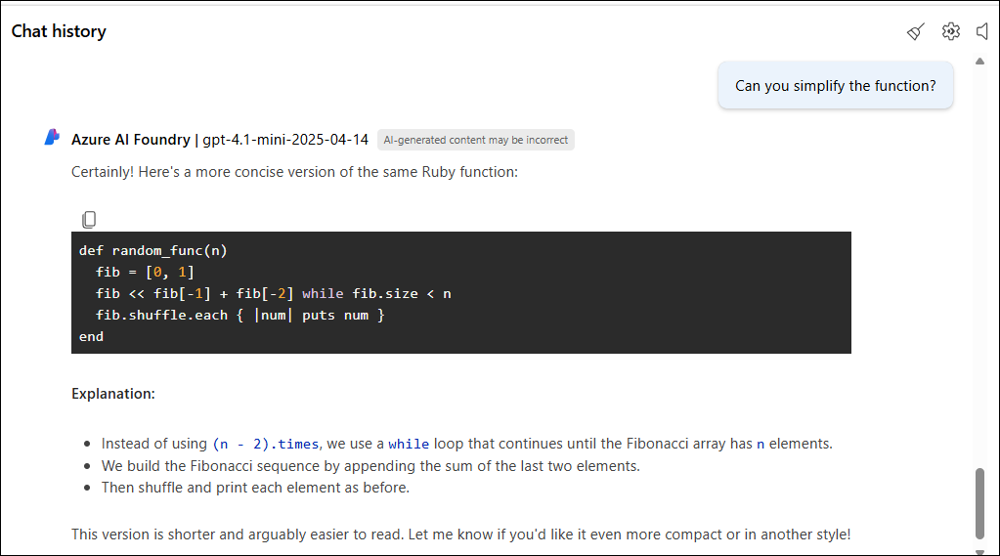

1. Submit the below-mentioned prompt to add comments to the code.

      ```
      Add some comments to the function.
      ```

      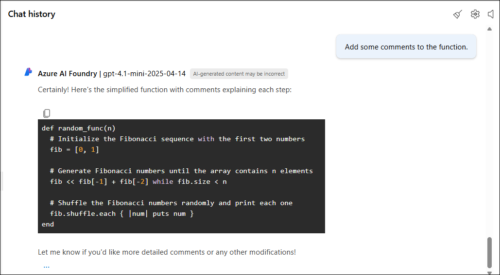

1. Observe the output, which includes comments explaining what each part of the function does. 

## Task 4: Set up an application in Cloud Shell

In this task, you will use a short command-line application running in Cloud Shell on Azure to demonstrate how to integrate with an Azure OpenAI model. Open a new browser tab to access Cloud Shell.

1. In the [Azure portal](https://portal.azure.com?azure-portal=true), select the **[>_]** (*Cloud Shell*) button at the top of the page to the right of the search box. A Cloud Shell pane will open at the bottom of the portal.

    

   > **Note**: If you dont see the **[>_]** (*Cloud Shell*) button, click on three dots **(...)(1)** and select **Cloud Shell(2) (2)**

             

1. The first time you open the Cloud Shell, you may be prompted to choose the type of shell you want to use (*Bash* or *PowerShell*). Select **Bash**. If you don't see this option, skip the step.  

   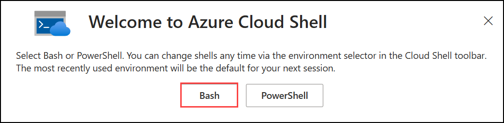

1. If you're prompted as Getting Started click on **Mount storage account (1)** select the available subscription **(2)** and click on **Apply (3)**.

   

1. Select **I want to create a storage account (2)** and click on **Next (2)**.

   

1. Within the **Create storage account** pane, enter the following details:
    - **Subscription**: Default- Choose the only existing subscription assigned for this lab (1).
    - **Resource group**: Select openai-<inject key="Deployment-ID" enableCopy="false"></inject>(2)
    - **CloudShell region**: East US (3)
    - **Storage Account Name**: storage<inject key="Deployment-ID" enableCopy="false"></inject>(4)
    - **File share**: Enter **none** (5)
    - Click **Create** (6)

      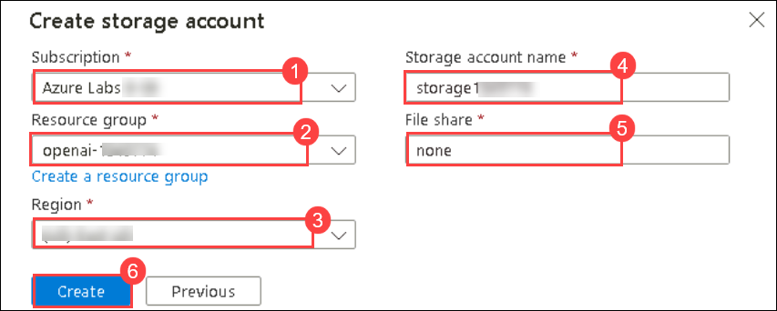

3. Once the terminal opens, click on **Settings (1)** and select **Go to Classic version (2)**.

   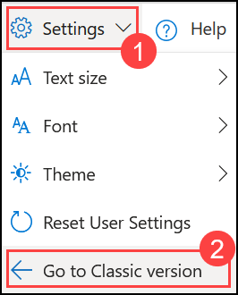

4. Once the terminal starts, enter the following command to download the sample application and save it to a folder called `mslearn-openai`.

    ```bash
   rm -r mslearn-openai -f
   git clone https://github.com/CloudLabs-MOC/mslearn-openai
    ```

5. The files are downloaded to a folder named **mslearn-openai**. Navigate to the lab files for this task using the following command.

    ```bash
    cd mslearn-openai/Labfiles/04-code-generation
    ```

   > **Note:** Applications for both C# and Python have been provided, as well as sample code we'll be using in this lab.

6. Use the following command to open the lab files in the code editor.

    ```bash
    code .
    ```

   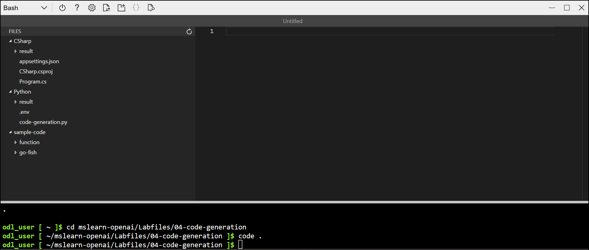

## Task 5: Configure your application

In this task, you will complete key parts of the application to enable it to use your Azure OpenAI resource.

1. In the code editor, expand the language folder for your preferred language.

1. Open the configuration file for your language.

    - **C#:** `appsettings.json`
    - **Python:** `.env`

1. In the configuration file, enter the following values for your Azure OpenAI service:

    - **Endpoint**: The endpoint URL from your Azure OpenAI resource.
    - **Key1**: The primary key from your Azure OpenAI resource.
    - **Deployment Name**: Set this to **my-gpt-model** (the name of your model deployment).
    After updating these values, save the file by right-clicking it in the left pane.

   > **Note:** You can get the Azure OpenAI endpoint and key values from the Azure OpenAI resource's **Key and Endpoint** section under **Resource Management**.

   - **C#:**

      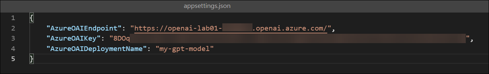

   - **Python:**

      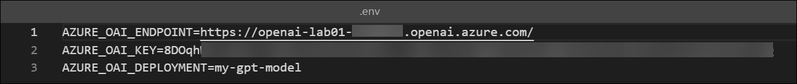

1. Navigate to the folder for your preferred language and install the necessary packages. Enter the below-mentioned command to add the `Azure.AI.OpenAI` package to your project, which is necessary for integrating with Azure OpenAI services.

   For **C#:** 

    ```
    cd CSharp
    dotnet add package Azure.AI.OpenAI --version 1.0.0-beta.5
    ```
    
    For **Python:**

      ```bash
    cd Python
    pip install --user openai==1.65.2
    ```

1. Open the application code file of your preferred language and briefly observe the code. 

    - **C#:** `Program.cs`
    - **Python:** `code-generation.py`

## Task 6: Run your application

In this task, you will run your configured app to generate code for each use case, which is numbered in the app and can be executed in any order.

> **Note:** Some users may experience rate limiting if calling the model too frequently. If you hit an error about a token rate limit, wait for a minute then try again.

1. In the code editor, expand the `sample-code` folder and briefly observe the function and the app for your language. The OpenAI tool will use these files to generate the responses. 
   
   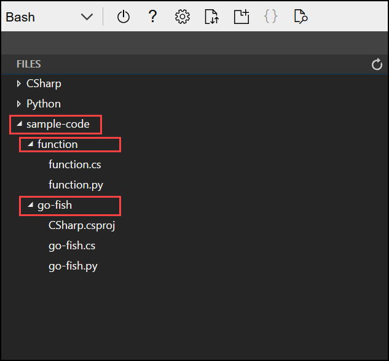

1. In the Cloud Shell bash terminal, navigate to the folder for your preferred language.

1. Run the application.

    - **C#:** `dotnet run`
    - **Python:** `python code-generation.py`

      >**Note:** If you encounter any errors after running the Python script, try upgrading the OpenAI package by running the following command: `pip install --user --upgrade openai`

1. Choose option **1** to add comments to your code. Note, the response might take a few seconds for each of these tasks.

   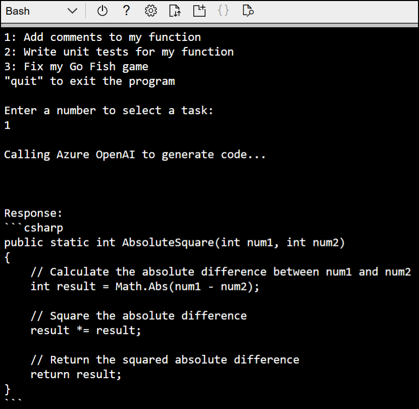

1. In the response, you will see that OpenAI has added comments to your sample code provided from the function file. 

1. Next, choose option **2** to write unit tests for that same function.

   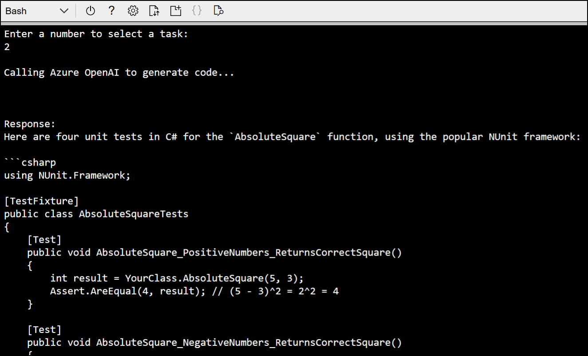

1. In the response, you will notice that the unit tests are added to your sample code.

1. Next, choose option **3** to fix bugs in an app for playing Go Fish. 

   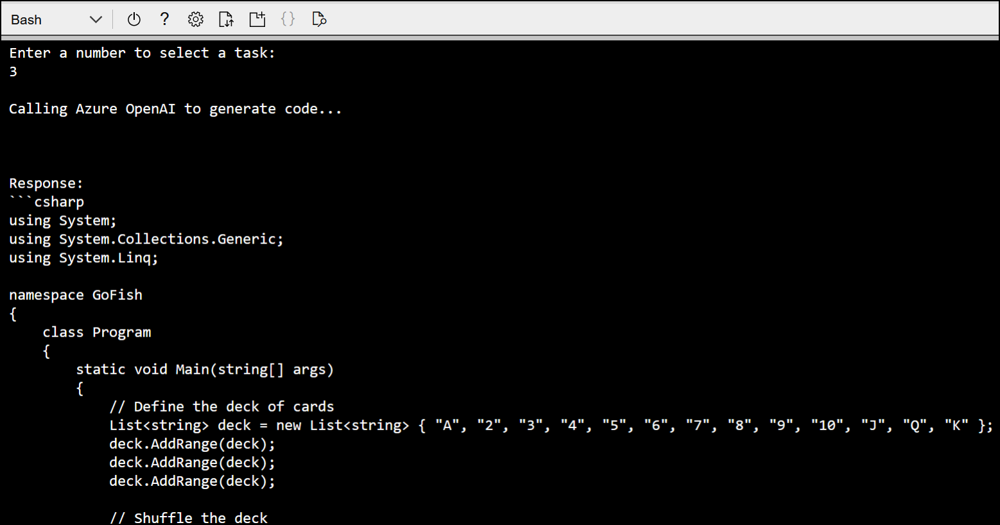

1. This time, OpenAI would use the go fish file and fix the code in it and respond with the updated code. 

1. The results will replace what was in `result/app.txt`, and should have very similar code with a few things corrected.

    - **C#:** Fixes are made on lines 30 and 59
    - **Python:** Fixes are made on lines 18 and 31

        >**Note:** Click on Ctrl+C to stop the project.

10. To check the results, paste the following code in the terminal:

    ```
    cd result
    ```

11. Copy the below command in the terminal to see the contents of the app.txt file.

     ```
     cat app.txt
     ```

      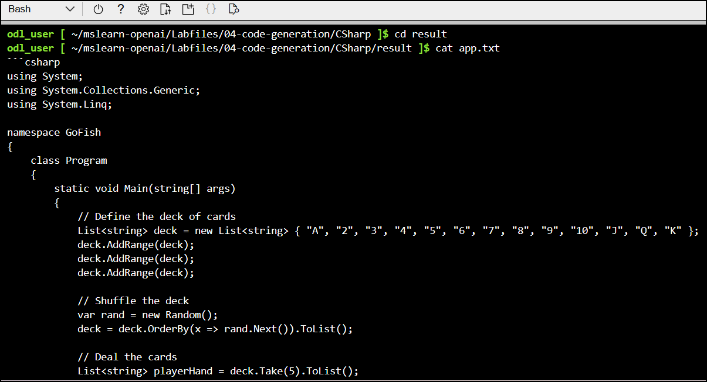

The app for Go Fish in `sample-code` can be run if you replace the lines with bugs with the response from Azure OpenAI. If you run it without the fixes, it will not work correctly.

It's important to note that even though the code for this Go Fish app was corrected for some syntax, it's not a strictly accurate representation of the game. If you look closely, there are issues with not checking if the deck is empty when drawing cards, not removing pairs from the player's hand when they get a pair, and a few other bugs that require an understanding of card games to realize. This is a great example of how useful generative AI models can be to assist with code generation, but they can't be trusted as correct and need to be verified by the developer.

If you would like to see the full response from Azure OpenAI, you can set the `printFullResponse` variable to `True` and re-run the app.

## Summary

In this lab, you explored how to use Azure OpenAI Service to generate, explain, and improve code using natural language prompts. You generated code in different programming languages, explained existing code, and simplified functions using the chat playground. You also set up a command-line application in Cloud Shell, configured it to use your Azure OpenAI resource, and ran the application to automate code tasks such as adding comments, writing unit tests, and fixing bugs.

### You have successfully completed the lab. Click on **Next >>** to proceed with the next lab.
     
