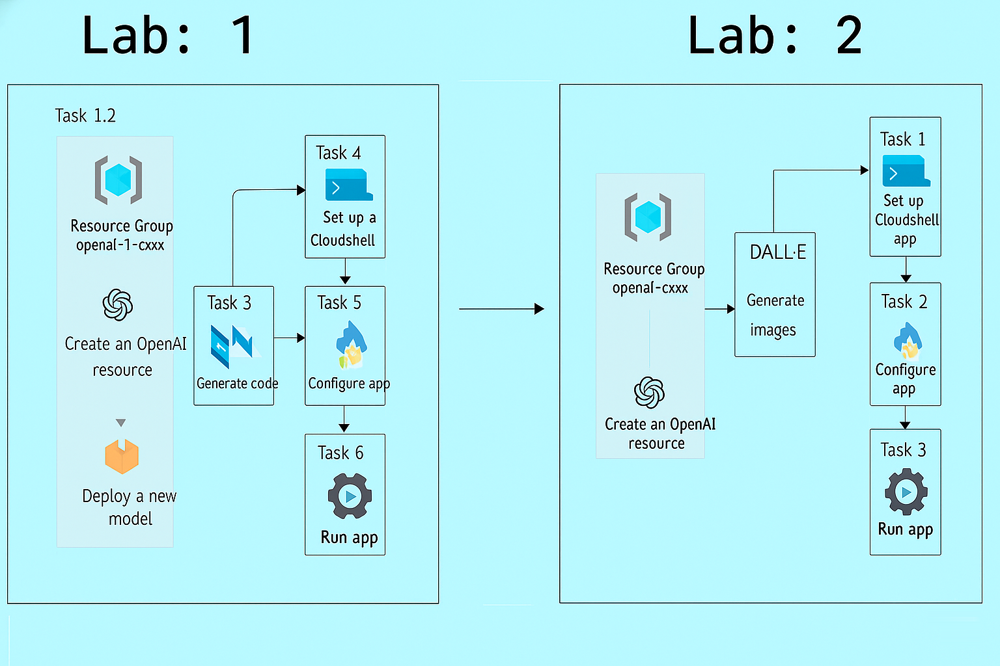
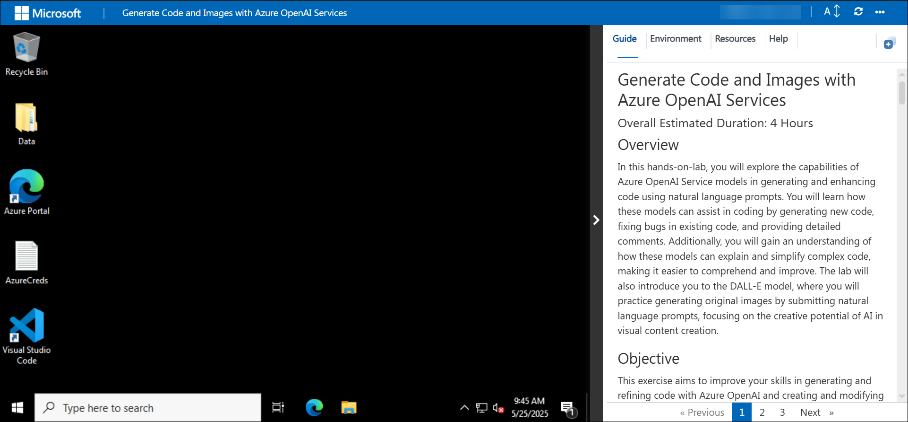
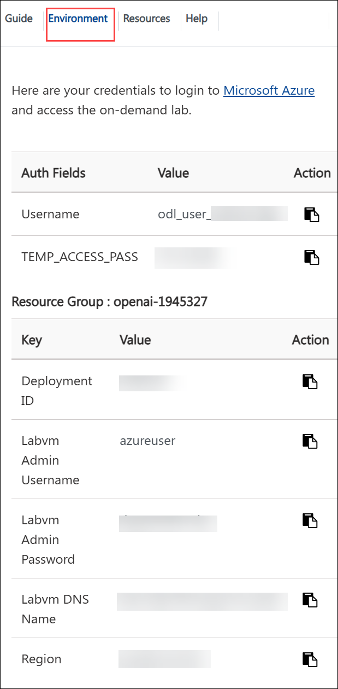
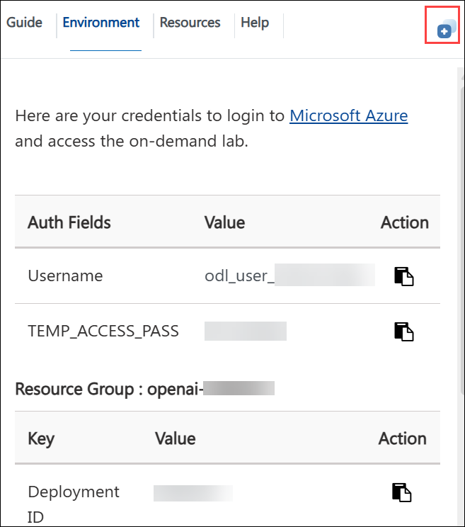
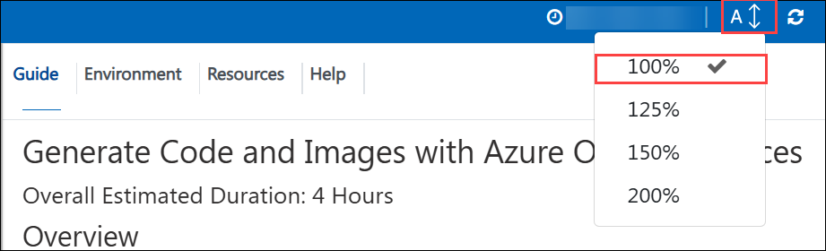
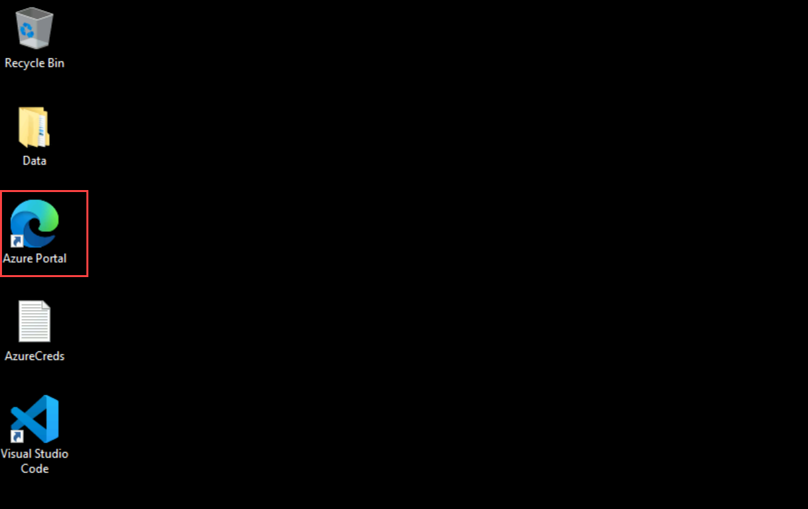
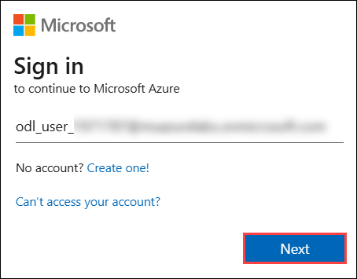
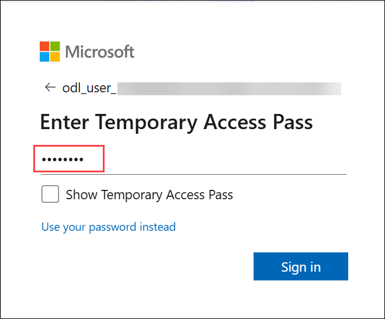
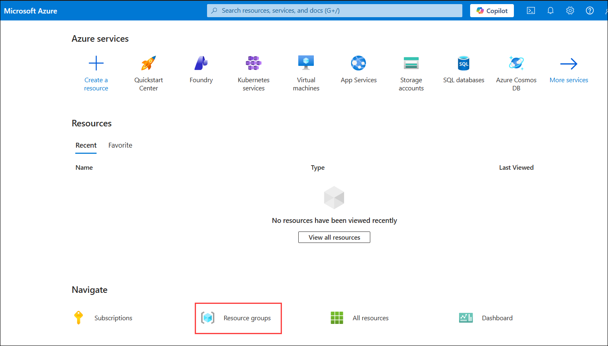

# Generate Code and Images with Azure OpenAI Services

### Overall Estimated Duration: 4 Hours

## Overview

In this hands-on-lab, you will explore the capabilities of Azure OpenAI Service models in generating and enhancing code using natural language prompts. You will learn how these models can assist in coding by generating new code, fixing bugs in existing code, and providing detailed comments. Additionally, you will gain an understanding of how these models can explain and simplify complex code, making it easier to comprehend and improve. The lab will also introduce you to the DALL-E model, where you will practice generating original images by submitting natural language prompts, focusing on the creative potential of AI in visual content creation.

## Objective 

This exercise aims to improve your skills in generating and refining code with Azure OpenAI and creating and modifying images using the DALL-E model to achieve desired outcomes. By completing this lab, you will learn:

1. **Generate and improve code with Azure OpenAI Service**: The goal of this hands-on exercise is to demonstrate how to effectively generate and refine code using Azure OpenAI. You will improve your abilities to create and refine code with Azure OpenAI Service tools and approaches.

2. **Generate images with a DALL-E model**: The goal of this hands-on activity is to produce and alter images using the DALL-E model. To attain the intended visual results, you will develop and alter images using the DALL-E model.

## Prerequisites

1. **Development Skills**: Basic programming knowledge and experience with APIs and SDKs.
2. **AI Concepts**: Understanding prompt engineering, code development, and image generation using models such as DALL-E.
3. **Content Management**: Understanding data integration for RAG and content filtering techniques.
   
## Architecture

In this hands-on lab, you will follow an architecture flow that begins with exploring Azure OpenAI Service models, where you'll use natural language prompts to generate and enhance code. The flow progresses through stages of code generation, bug fixing, and detailed commenting, leveraging AI to simplify and explain complex code. The final stage introduces the DALL-E model, where you'll practice generating original images from natural language prompts, highlighting the creative potential of AI in visual content creation. This flow seamlessly integrates AI-driven coding and creative image generation, providing a comprehensive understanding of Azure OpenAI's capabilities.

## Architecture Diagram

   

## Explanation of Components

- **Azure OpenAI**: Integrates your data with massive language models, allowing for personalized and secure interactions.Allows for fine-tuning of AI models with your own datasets, resulting in specialized and relevant outputs for your business needs.
- **Azure OpenAI Models**: Provides pre-trained and customisable big language models for a variety of AI applications, including text generation, sentiment analysis, and language translation, with the option to tailor models to specific use cases.
- **Azure CloudShell**: Offers an online, browser-based shell for managing Azure resources and running scripts.Allows you to deploy, manage, and automate Azure services directly from your web browser, eliminating the need for local installations.
- **DALL-E**: DALL-E uses artificial intelligence technology to generate visuals from written descriptions.Enhances creativity by translating word inputs into distinct and coherent pictures.

## Getting Started with Lab

## Accessing Your Lab Environment

Once the environment is provisioned, a virtual machine (LabVM) and lab guide will get loaded in your browser. Use this virtual machine throughout the workshop to perform the lab. You can see the number on the lab guide bottom area to switch to different exercises of the lab guide.

   

## Virtual Machine & Lab Guide

Your virtual machine is your workhorse throughout the workshop. The lab guide is your roadmap to success.

## Exploring Your Lab Resources
   
To get a better understanding of your lab resources and credentials, navigate to the **Environment** details tab.

   

## Managing Your Virtual Machine
 
Feel free to **Start, Stop, or Restart (2)** your virtual machine as needed from the **Resources (1)** tab. Your experience is in your hands!
 
.png)

## Utilizing the Split Window Feature

For convenience, you can open the lab guide in a separate window by selecting the **Split Window** button from the top right corner.

## Lab Guide Zoom In/Zoom Out

To adjust the zoom level for the environment page, click the **A↕ : 100%** icon located next to the timer in the lab environment.

   

## Login to Azure Portal

1. In the LabVM, click on **Azure portal** shortcut of Microsoft Edge browser which is created on desktop.

   
   
1. On **Sign into Microsoft Azure** tab you will see login screen, in that enter following email/username and then click on **Next**.
   
    - **Email/Username**: <inject key="AzureAdUserEmail"></inject>
   
        
     
1. Now enter the Temporary Access Pass and click on **Sign in**.

   - **Temporary Access Pass**: <inject key="AzureAdUserPassword"></inject>
   
      
       
1. If you see the pop-up **Stay Signed in?**, click **Yes**.

1. If a **Welcome to Microsoft Azure** popup window appears, click **Cancel** to skip the tour.

1. Now you will see Azure Portal Dashboard, click on **Resource groups** from the Navigate panel to see the resource groups.

     

1. Confirm you have a resource group **openai-<inject key="Deployment-id" enableCopy="false"/>** present as shown in the below screenshot. You need to use the **openai-<inject key="Deployment-id" enableCopy="false"/>** resource group throughout the entire process of lab execution.

     

## Support Contact
 
The CloudLabs support team is available 24/7, 365 days a year, via email and live chat to ensure seamless assistance at any time. We offer dedicated support channels tailored specifically for both learners and instructors, ensuring that all your needs are promptly and efficiently addressed.

Learner Support Contacts:

- Email Support: cloudlabs-support@spektrasystems.com
- Live Chat Support: https://cloudlabs.ai/labs-support

Click on the **Next** button from lower right corner to move on to the next page.

### Happy learning!
